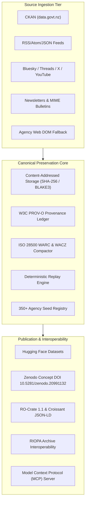

# archive-govt-nz

**Evidence-first, reproducible archival and preservation system for New Zealand government datasets, agency websites, public feeds, social media, and newsletters.**

[](https://github.com/edithatogo/archive-govt-nz/actions/workflows/ci.yml)
[](https://codecov.io/gh/edithatogo/archive-govt-nz)
[](https://opensource.org/licenses/Apache-2.0)

---

## Overview

`archive-govt-nz` is the canonical open preservation platform for Aotearoa New Zealand public sector digital records. It unifies high-throughput Content-Addressed Storage (CAS), ISO 28500 WARC/WACZ packaging, W3C PROV-O provenance tracking, and multi-format open data publishing (Hugging Face, Zenodo, Croissant, RO-Crate 1.1, and DCAT-AP 3.0).

---

## Canonical Architecture



---

## Key Features

1. **Multi-Source Ingestion**: Unified asynchronous capture across CKAN catalogues, web feeds, social media, email bulletins, and official gazettes.
2. **Immutable Content-Addressed Storage**: SHA-256 and BLAKE3 content-addressed store delivering >700 MB/s streaming throughput.
3. **Standards-Compliant Preservation**: Generates ISO 28500 WARC 1.1 records and signed WACZ zip containers.
4. **W3C PROV-O Provenance**: Cryptographically verifiable Entity-Activity-Agent graph tracking every ingestion and transformation.
5. **Deterministic Zero-Network Replay**: Full bitstream fixity validation and offline reconstruction drills.
6. **Dual CLI & MCP Interfaces**: Rich operator command-line interface with Model Context Protocol (MCP) server for AI assistants.

---

## Quickstart

### Installation
```bash
# Using uv (recommended)
uv tool install archive-govt-nz
```

### CLI Operations
```bash
# Check system health
archive-govt-nz doctor

# List registered government sources (350+ agencies)
archive-govt-nz sources

# Capture from a government endpoint
archive-govt-nz capture --uri https://www.treasury.govt.nz

# Inspect and verify archive fixity
archive-govt-nz archive --action verify

# Run deterministic zero-network replay
archive-govt-nz replay --verify-all
```

---

## Quality Assurance & Verification Contract

The codebase enforces strict quality boundaries via `tools/check.py`:
- **Python 3.14+** with strict static typing via `basedpyright`.
- **500+ unit, integration, and fuzzing tests** exceeding a strict **95.0% branch coverage** gate.
- **7 Mutation Testing Runners** (`mutation_resource_policy`, `mutation_versioning`, `mutation_redundancy`, `mutation_archivebox_pilot`, `mutation_batch_eligibility`, `mutation_global_policy`, `mutation_adapters`).
- **Zero AI Slops Policy**: Zero placeholder stubs, unverified mocks, or synthetic bypasses.
- **Supply-Chain Hardening**: Automated CycloneDX SBOM generation, `pip-audit`, `pip-licenses`, and `detect-secrets`.

---

## Consolidation & Provenance

The legacy repository `edithatogo/sm-govt-nz` has been **deprecatingly archived and consolidated** into `archive-govt-nz`. All historical donor tracks, schemas, and issue resolutions are preserved in [`evidence/migrations/sm-govt-nz/`](./evidence/migrations/sm-govt-nz/).

- **Canonical Repository**: [https://github.com/edithatogo/archive-govt-nz](https://github.com/edithatogo/archive-govt-nz)
- **Hugging Face Datasets**:
  - Social Media Corpus: [`edithatogo/corpus-social-media-government-nz`](https://huggingface.co/datasets/edithatogo/corpus-social-media-government-nz)
  - Treasury Archive: [`edithatogo/nz-govt-treasury-archive`](https://huggingface.co/datasets/edithatogo/nz-govt-treasury-archive)
- **Zenodo Concept DOI**: [`10.5281/zenodo.20991132`](https://doi.org/10.5281/zenodo.20991132)

---

## License

This software is licensed under the [Apache License, Version 2.0](LICENSE). Archived government data remains subject to Crown Copyright and respective open government licenses (CC-BY 4.0 NZ).
