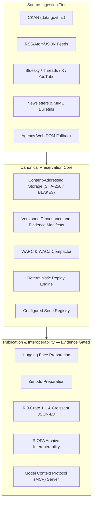

# archive-govt-nz

**Evidence-first, reproducible archival and preservation system for New Zealand government datasets, agency websites, public feeds, social media, and newsletters.**

[](https://github.com/edithatogo/archive-govt-nz/actions/workflows/ci.yml)
[](https://codecov.io/gh/edithatogo/archive-govt-nz)
[](https://opensource.org/licenses/Apache-2.0)

---

## Overview

`archive-govt-nz` is the canonical target repository for evidence-first
preservation of Aotearoa New Zealand public-sector digital records. It contains
content-addressed storage, WARC/WACZ packaging, provenance and manifest models,
source adapters, and publication preparation components. Production capture,
remote publication, redistribution rights, recovery, cutover, and donor
archival remain separate evidence gates; repository presence or a passing local
test does not establish those operational states.

---

## Canonical Architecture



---

## Key Features

1. **Config-driven source-set capture**: `capture --source-set <name>` performs
   bounded network acquisition against declared YAML source sets, persists each
   response as a WARC 1.1 record, and emits content-addressed capture receipts.
   Sources requiring credentials or discovery infrastructure are recorded as
   `capability_pending` rather than silently skipped. Domain adapters exist for
   CKAN, feeds, social sources, newsletters, legislation, and gazette records.
2. **Content-addressed storage**: Immutable SHA-256/BLAKE3 object identities
   with streaming fixity verification.
3. **Preservation containers**: WARC and WACZ construction and structural
   validation; no signature or conformance claim is inferred from packaging.
4. **Provenance evidence**: Versioned closed manifests and evidence-ledger
   validation tied to observed objects and transformations.
5. **Zero-network verification**: Streaming CAS replay and fixity checks over
   supplied local state. This is not a claim of full-corpus recovery.
6. **CLI and MCP entry points**: A fail-closed global CLI is implemented. The
   MCP surface remains scheduled for separate current-standard hardening.

---

## Quickstart

### Local installation
```bash
uv sync --locked
```

### CLI Operations
```bash
# Check only the declared Python runtime
uv run --locked archive-govt-nz doctor --format json

# Inspect configured seed files
uv run --locked archive-govt-nz sources --format json

# Verify a closed WARC/WACZ directory against declared SHA-256 fixity
uv run --locked archive-govt-nz archive --action verify \
  --output-dir build/warc \
  --manifest-path build/warc/manifest.json \
  --format json

# Stream-verify a production-layout content-addressed store
uv run --locked archive-govt-nz replay --cas-dir build/cas --format json

# Run the combined local integrity checks
uv run --locked archive-govt-nz verify \
  --cas-dir build/cas \
  --schemas-dir schemas \
  --provenance-path evidence/archive-evidence-ledger.json \
  --format json
```

Commands return non-zero when required state is absent, corrupt, unsupported,
or blocked.

### Scheduled multi-source harvesting
```bash
# Capture one configured source set (network operation)
uv run --locked archive-govt-nz capture --source-set treasury \
  --output-dir build/receipts/treasury --warc-dir build/warc/treasury

# Generate and verify fixity over captured WARC output
uv run --locked archive-govt-nz archive --action manifest --output-dir build/warc/treasury
uv run --locked archive-govt-nz archive --action verify --output-dir build/warc/treasury
```
The `scheduled-multi-source-harvest` workflow runs this sequence per configured
source set on a schedule, uploads receipts and WARC artifacts, and fails closed
on any capture or fixity error. Use domain runners only where their own runbook
and evidence gates authorize them.

---

## Quality Assurance & Verification Contract

The codebase enforces strict quality boundaries via `tools/check.py`:
- **Python 3.14+** with strict static typing via `basedpyright`.
- **Locked validation harness**: Unit, integration, and adversarial tests enforce
  at least **95% branch-aware coverage**. Exact local results are recorded in the
  active Conductor track; they are not hosted or operational proof.
- **11 Mutation Testing Runners** (`mutation_resource_policy`, `mutation_versioning`, `mutation_redundancy`, `mutation_archivebox_pilot`, `mutation_batch_eligibility`, `mutation_global_policy`, `mutation_adapters`, `mutation_gazette`, `mutation_medallion`, `mutation_platinum`, `mutation_nlp_bridge`).
- **Differential parity gate**: every change re-runs a 9-source-class donor-vs-canonical parity harness (`parity` stage); divergences fail the build.
- **Hygiene gate**: The repository validator rejects configured placeholder and
  forbidden-pattern classes.
- **Supply-Chain Hardening**: Automated CycloneDX SBOM generation, `pip-audit`, `pip-licenses`, and `detect-secrets`.

Run the deterministic, process-isolated gate before every pull request:

```bash
./scripts/validate.sh
```

The wrapper uses the verified xdist `auto/loadscope` profile so the full suite
stays within the bounded test-stage timeout. The underlying runner retains a
serial diagnostic mode when invoked without worker options. A separate heavy
profile keeps mutation and resource profiling out of the ordinary lane:

```bash
# Re-run the complete suite under the wrapper's isolated xdist profile.
uv run --locked python tools/check.py --pytest-workers auto \
  --pytest-distribution loadscope

# Append bounded pytest-gremlins and Bronze-to-Gold Scalene evidence stages.
uv run --locked python tools/check.py --include-heavy
```

Parallel results are same-host timing evidence only. Scalene writes a portable,
path-redacted summary to `build/profiling-scalene.json`; raw profiler output and
all generated coverage shards remain ignored local derivatives.

---

## Consolidation & Provenance

The donor repository `edithatogo/sm-govt-nz` was **archived on 2026-08-25**
after its canonical replacement was activated and verified, following the
auditable chain in [`evidence/migrations/sm-govt-nz/`](./evidence/migrations/sm-govt-nz/):
closeout correction → retirement attestation → maintainer authorization → final
disposition receipt (with recorded exceptions). A weekly claim-drift lane
(`scheduled-claim-drift-detection`) continuously compares Conductor records
against live GitHub state and fails closed on divergence.

- **Canonical Repository**: [https://github.com/edithatogo/archive-govt-nz](https://github.com/edithatogo/archive-govt-nz)
- **Hugging Face Datasets**:
  - Social Media Corpus: [`edithatogo/corpus-social-media-government-nz`](https://huggingface.co/datasets/edithatogo/corpus-social-media-government-nz)
  - Treasury Archive: [`edithatogo/nz-govt-treasury-archive`](https://huggingface.co/datasets/edithatogo/nz-govt-treasury-archive)
- **Zenodo Concept DOI**: [`10.5281/zenodo.20991132`](https://doi.org/10.5281/zenodo.20991132)

---

## License

This software is licensed under the [Apache License, Version 2.0](LICENSE).
Archived source material retains its own copyright, licence, access, and
redistribution conditions; public accessibility is not blanket redistribution
permission.
