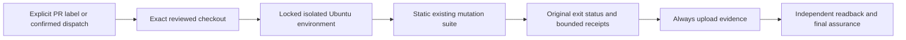

# Design

The existing full CI harness omits dedicated supplementary mutation runners.
Two local parent-state baselines failed before mutants on Hypothesis timing
variability while observed host load exceeded 90. A static opt-in hosted matrix
runs the unchanged suites independently, retaining their original failure semantics.
No deadline or acceptance threshold changes.

The workflow has contents-read permission, no credential persistence, and no
publication commands. Script paths are static matrix values, never operator
shell input. Logs and JSON receipts are collected without mutated Python files.
Count and size checks occur before reading files for fixity. An exceeded budget
fails evidence generation rather than producing a successful bounded receipt.
