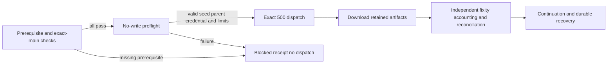

# Design

The superseding observation follows the successful path. Standalone preflight
33968519628 precedes full run 33968609350; both use the reviewed source-preflight
correction on main. Independent readback verifies the artifact digests, state,
accounting and continuation. Earlier blocked and failed observations remain
historical evidence. Credential values are never recorded. The approved durable
552-record parent and retained 904-record output have distinct custody scopes.
