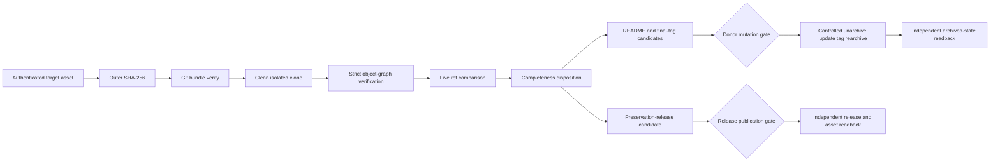

# Design

The asset response, downloaded bytes, advertised bundle heads, restored Git
graph, live donor refs and required repository files are independent evidence
layers. A successful clone proves restoration of advertised refs; it does not
prove that every live branch and tag was included. Completeness therefore
requires an explicit set comparison.

The donor presentation is prepared as target-owned text. It cannot become a
claim about live donor state until the controlled external sequence and remote
readback occur. The bundle preserves repository history and code licensing; it
does not grant redistribution rights over every source payload referenced by
that history.
