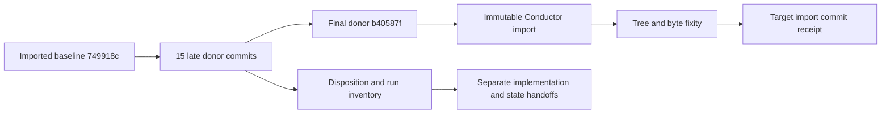

# Lineage boundaries

```mermaid
flowchart LR
 B[Imported baseline 749918c] --> D[15 late donor commits]
 D --> F[Final donor b40587f]
 F --> I[Immutable Conductor import]
 D --> R[Disposition and run inventory]
 I --> V[Tree and byte fixity]
 R --> H[Separate implementation and state handoffs]
 V --> T[Target import commit receipt]
```

Historical operational claims are observations, not current target completion.
