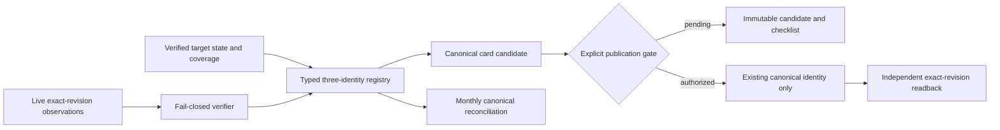

# Design

Every remote statement is revision-bound. Registry roles are unique, coverage populations remain distinct, and rights describe source-specific evidence rather than a repository-wide licence.
