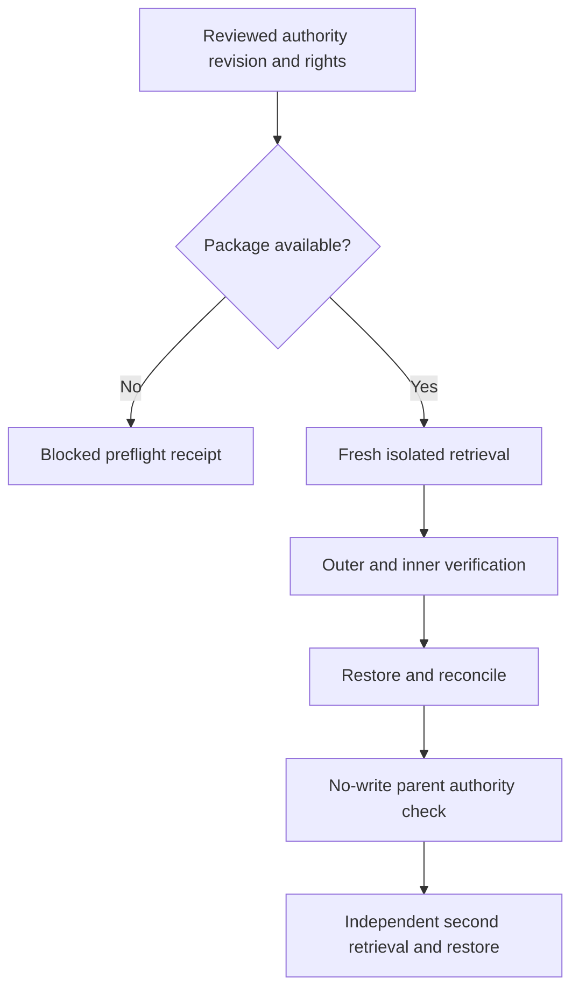

# Recovery boundary

No publication client or package-format changes. Every failed branch retains evidence outside the disposable workspace. No retained Actions artifact or local package substitution.
