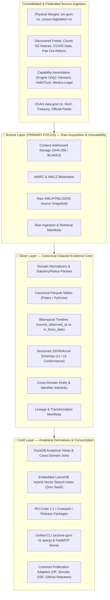

# Specification: Medallion Architecture Consolidation with Integrated Vector & Knowledge Graph Products

- **Track ID:** `medallion_architecture_consolidation_20260823`
- **Domain Scope:** All core canonical NZ archive domains + discovered domain feeds
- **Federated Alignment:** [`edithatogo/global-medicines-atlas`](https://github.com/edithatogo/global-medicines-atlas), [`edithatogo/fyi-archive`](https://github.com/edithatogo/fyi-archive), [`edithatogo/open_social_data`](https://github.com/edithatogo/open_social_data)
- **Status:** `new`

---

## 1. Overview & Architectural Vision

This track establishes the canonical, evidence-first **Medallion Data Architecture (Bronze → Silver → Gold)** for `archive-govt-nz`, strictly aligned with the design patterns, bitemporal data models, and zero-copy federation contracts in `global-medicines-atlas`.

Semantic vector search and knowledge graph relations are subsumed directly into the **Gold Layer** as deterministic, embedded derived products built on top of canonical **Silver Parquet** tables.



---

## 2. Consolidation & Federation Boundary Map

The repository estate is organized into six explicit architectural groups:

```text
archive-govt-nz (Canonical Preservation Repository)
├── Group 1: Physical Merges (Completed)
│   ├── sm-govt-nz
│   └── corpus-legislation-nz
│
├── Group 3: Discovered Domain Inclusions (Folded into Bronze)
│   ├── courts-nz-public-notices-archive (Courts/Notices domain)
│   ├── nz-covid-data (Health historical snapshots)
│   └── pae_ora_reform (Health policy releases)
│
├── Group 2: Sequential Capability Assimilations (Engine Only; Standalone CLIs/MCPs)
│   ├── corpus-nz-hansard (Debate XML parser & MP models)
│   ├── hathi-nz (Historic OCR bitstreams & rights classification)
│   └── corpus-cases-medilegal-nz (Tribunal decision normalizers & anonymization)
│
└── Group 4: Cross-Repository Federation Partners (Zero-Copy Parquet & DCAT-AP)
    ├── global-medicines-atlas (Cross-jurisdiction medicines & pricing)
    ├── reimbursement-atlas (International reimbursement schedules)
    ├── fyi-archive (Multi-country international FOI registers; NZ OIA cross-queries)
    └── open_social_data (Multi-national AU/NZ public social data engine)
```

### Boundary Invariants
1. **Physical Merges:** Limited to `sm-govt-nz` and `corpus-legislation-nz`.
2. **Capability Assimilation (Engine Only):** Ingest core parsing, normalization, and preservation machinery; external CLI/MCP tools remain independent in their donor repositories.
3. **Multi-Jurisdiction Federation:** `fyi-archive` (which contains AU/BE/EU/FR/NL/etc. registers) and `open_social_data` (which contains Australian Bureau of Statistics and data.gov.au providers) remain independent federated partners queried via zero-copy DuckDB Parquet joins.
4. **Standalone Products (Non-Merge Boundary):** `legislation`, `dnz`, `healthpoint-rs`, `fyi-cli`, `foi-o`, `foi-process`, `searchright`, and `sourceright` remain independent client tools.

---

## 3. Functional Requirements by Layer

### 3.1 🥉 Bronze Layer (Raw Ingestion — Primary Focus)
- **MUST-1 (Immutability & Integrity):** Strict immutability in CAS (`sha256/` and `blake3/`) and WARC/WACZ containers for raw XML, HTML, JSON, and PDF payloads across all domains (including Courts Notices, COVID data, and Pae Ora records).
- **MUST-2 (Ingestion Manifests):** Standard Bronze ingestion manifest format recording source URLs, timestamps, headers, payload digests, and rate limits.

### 3.2 🥈 Silver Layer (Canonical Evidence Core)
- **MUST-3 (Vectorized Parquet Pipelines):** Vectorize and normalize raw records into typed, schema-validated Apache Parquet and JSONL files (`data/silver/{domain}/corpus.parquet`) using **Polars** and **PyArrow**.
- **MUST-4 (Bitemporal Tracking):** Record transaction time (`source_observed_at`) alongside valid time (`effective_date`, `in_force_date`, `revoked_date`) to support point-in-time reconstruction.
- **MUST-5 (Cross-Domain Entity Joins):** Maintain deterministic relational linkage tables (Statutes ↔ Gazette Notices ↔ Courts Notices ↔ Health Payloads ↔ CKAN packages) with confidence scoring and provenance pointers.

### 3.3 🥇 Gold Layer (Analytical Derivatives, Search & Knowledge Graph)
- **MUST-6 (DuckDB Analytical Engine):** Provide embedded **DuckDB** database views and SQL aggregation models over Silver Parquet for fast relational queries.
- **MUST-7 (Embedded LanceDB Hybrid Search):** Build a local LanceDB vector + BM25 hybrid search index derived directly from Silver Parquet, providing zero-network local semantic lookup without external SaaS lock-in.
- **MUST-8 (Semantic Knowledge Graph & Federation):** Export semantic linked data adhering to W3C **DCAT-AP 3.0**, **schema.org / Croissant**, and **RO-Crate 1.1** metadata models aligned with `global-medicines-atlas` and `fyi-archive`.
- **MUST-9 (CLI & MCP Query Interface):** Expose Gold DuckDB, LanceDB, and Knowledge Graph operations through `archive-govt-nz query` (`--sql`, `--semantic`, `--graph`) and FastMCP server tools.
