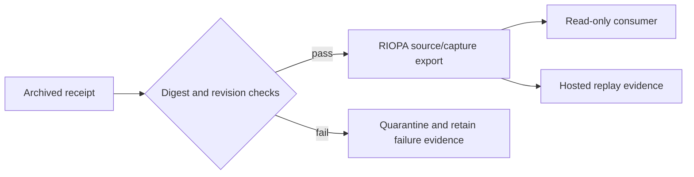

# Design: RIOPA interoperability integration

The bridge is archive-only. Rights or legal-status uncertainty is carried as
data and blocks promotion; it is never resolved by the adapter.

Only `captured` receipts with resolved rights and an `observed` or `resolved`
legal-status observation qualify for mapping. Eligibility is not legal clearance,
payload verification, publication or release approval. Other capture/legal states
remain quarantined. All new exports include seven false `claims` flags regardless
of source capability observations, which remain preserved in `boundaries`.

The v1 schema accepts historical exports without `claims`; when present, the
object must include all seven false flags. This preserves existing archived
records while making the boundary explicit for newly generated exports.
