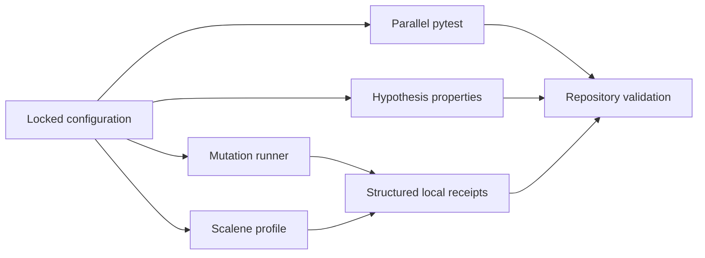

# Design: Testing Modernization and Performance Frontier

## Assurance flow

Mutation and profiling are bounded, explicit assurance lanes. They write
derived receipts under `build/`; they do not modify archived originals or
constitute hosted execution, publication, or release evidence.

`pytest-gremlins` configuration lives in `pyproject.toml` so local and CI
invocations share targets and operator policy. Coverage-guided selection stays
enabled by omitting the disabling flag. The configuration permits no pardons;
an exception therefore requires an explicit, reviewed policy change.
