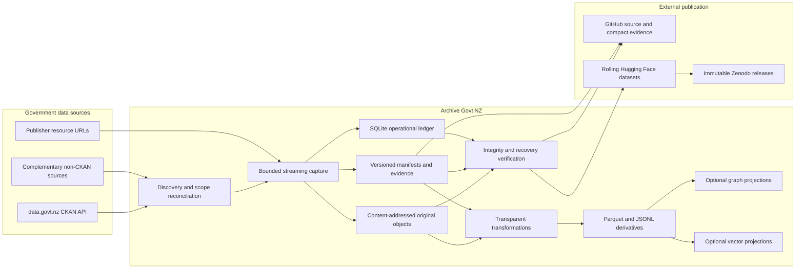
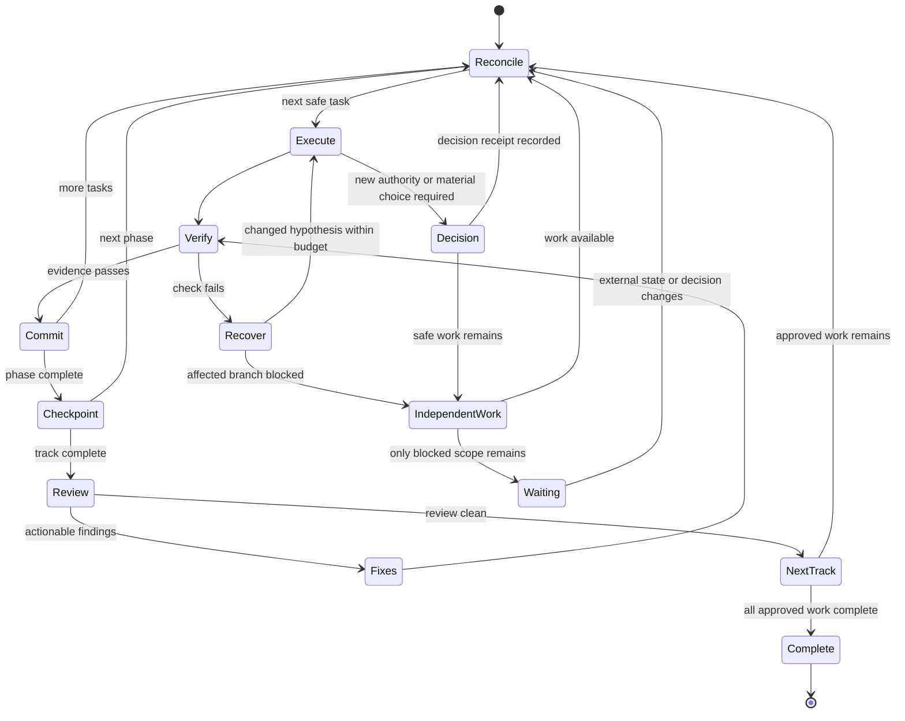
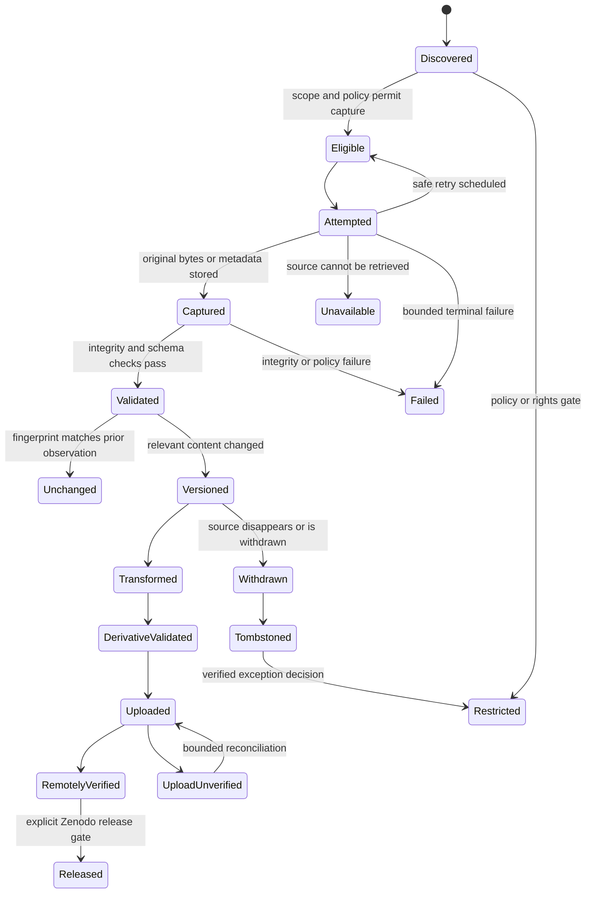
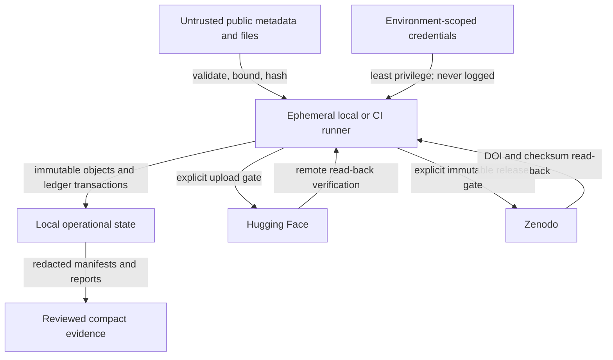

# Project Design

## Architectural intent

Archive Govt NZ separates source observation, immutable preservation,
reproducible derivation, and external publication. The preservation truth is the
combination of original objects, versioned manifests, and auditable evidence;
operational databases and search indexes remain reconstructable.

## System context

The optional graph and vector projections are downstream of validated tabular
derivatives. They cannot overwrite originals, manifests, or publication state.

## Autonomous delivery control

Task, phase, checkpoint, review, and track boundaries automatically return to
`Reconcile`; they are not handoff stops. Decision gates block only the affected
branch, and repository evidence provides the resumable state ledger. The
human-readable and machine-readable authority is linked from
`conductor/index.md`.

## Observation and publication states

An observed state transition produces a timestamped receipt. A workflow outcome
does not skip publication states.

## Trust boundaries

Inputs from public sources remain untrusted. Filenames, media types, archive
members, redirects, decompression, schemas, and claimed checksums require
validation and resource bounds.

## Version identity

A source observation identifies:

- catalogue and source dataset identifiers;
- metadata response object hash;
- each resource URL and retrieved object hash;
- observation and retrieval timestamps in UTC;
- prior observation relationship;
- policy, licence, rights, and availability state;
- transformation and derivative relationships;
- Git, Hugging Face, and Zenodo publication receipts.

Versions are created from material metadata or object changes, not merely from a
scheduled run. An unchanged verification still produces evidence without
duplicating the archived version.

## Storage roles

| Layer | Role | Authoritative |
| --- | --- | --- |
| Content-addressed objects | Original bytes and durable derivatives | Yes |
| Versioned manifests | Identity, provenance, relationships, states | Yes |
| SQLite ledger | Transactions, checkpoints, retries, resumability | Operational |
| Parquet/JSONL | Portable analysis and interchange | Derived |
| DuckDB | Reconciliation, validation, reporting | Rebuildable |
| Graph engine | Relationship query acceleration | Optional projection |
| Lance/LanceDB | Semantic retrieval | Optional projection |
| GitHub | Source, schemas, compact evidence, issues | Delivery evidence |
| Hugging Face | Rolling public dataset archive | Verified remote copy |
| Zenodo | Immutable citable release snapshot | Verified release copy |

## Recovery principle

A bounded release must be reconstructable from its manifest and referenced
objects without relying on SQLite, DuckDB, graph, or vector database files.
Recovery tests verify object integrity, manifest closure, derivative receipts,
and external publication relationships.
