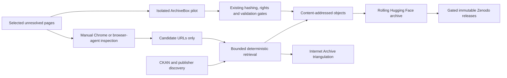
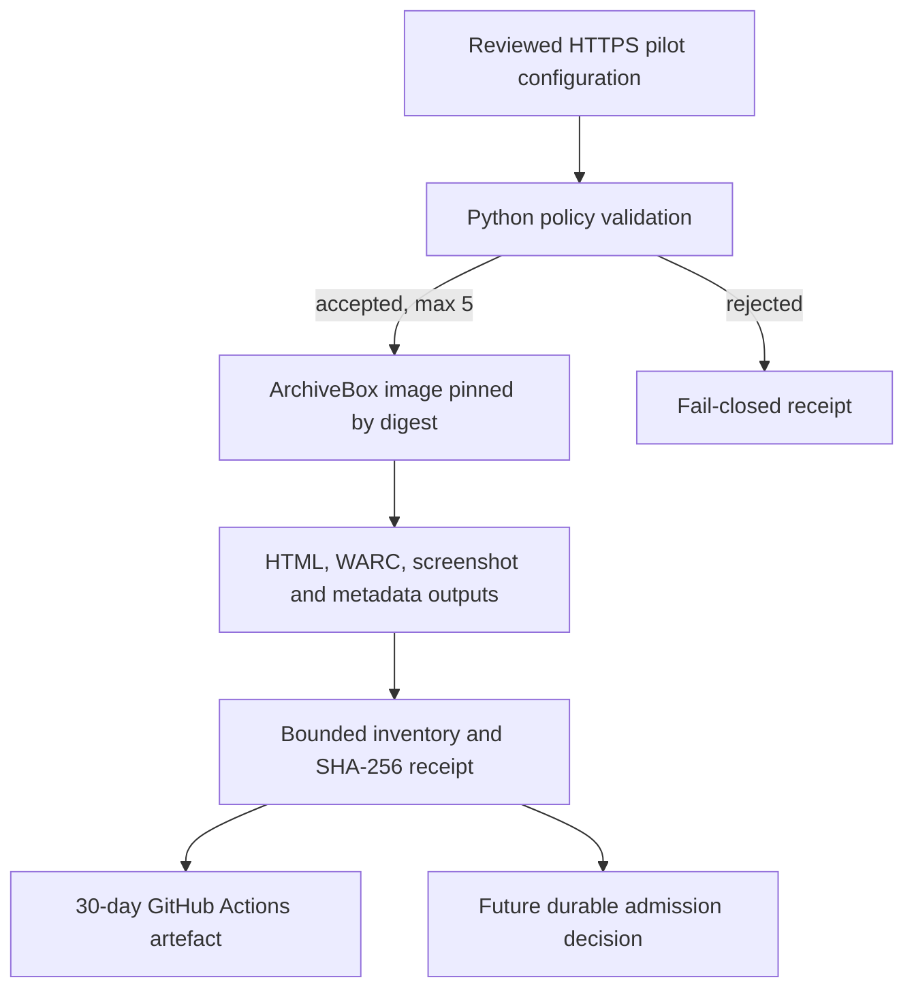

# Design

ArchiveBox is an isolated producer of secondary representations. The Python
policy layer owns input admission and receipt semantics. Existing archive gates
own durable object admission. GitHub Actions storage is not durable preservation.

The canonical reusable diagram and explanatory profile live at
`docs/archive-system-architecture.md`; publication systems copy or package that
file rather than maintaining divergent diagrams.
