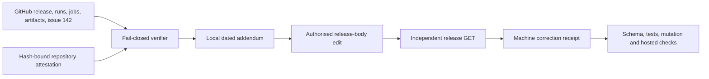

# Design

The correction is additive. A deterministic renderer authenticates the observed
release and repository attestation, then appends one dated addendum. The public
release is edited once under Prompt 18 authority and independently read back.

Trust boundaries:

- hosted responses are observed evidence and are hash-bound before mutation;
- the attestation is authoritative only at its exact repository path and hash;
- local preparation cannot set `applied_readback_verified`;
- remote success requires a post-write GET matching release ID, tag, tag commit,
  corrected addendum, and unchanged cycle 2 chain;
- the historical release tag, assets, issue comments, attestation, and receipts
  remain unchanged.
