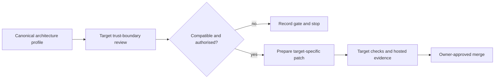

# Design

The current repository supplies the source-neutral architecture profile. The
target repository receives a compatibility assessment first; only a reviewed,
repository-specific patch may cross the external-repository boundary.

