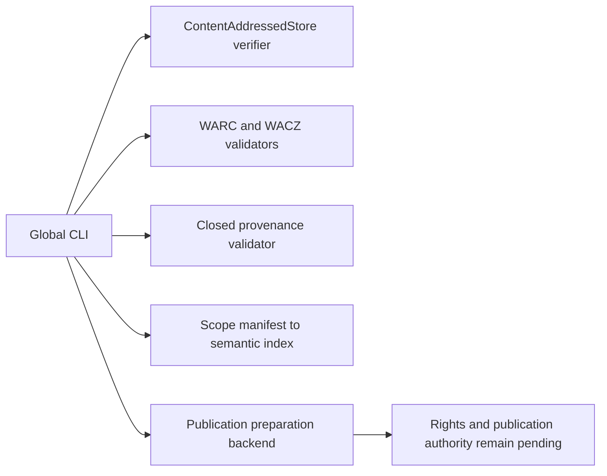

# Design

Each command delegates to an existing domain backend or a bounded validator.
Filesystem presence, filenames, empty directories, and credential presence are
observations rather than proof. Validation failures are structured and
fail-closed. Remote publication is not performed by this track.
