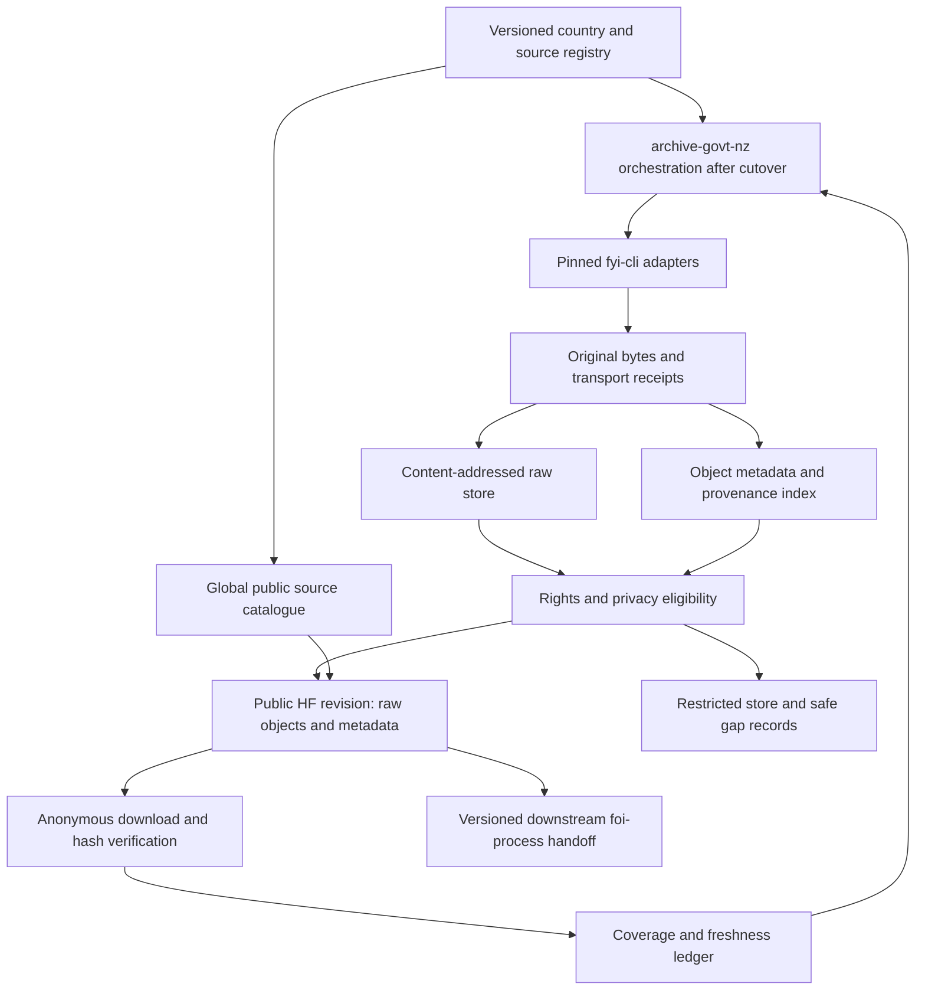
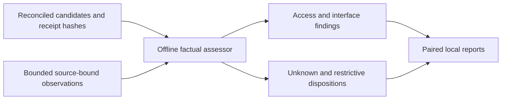
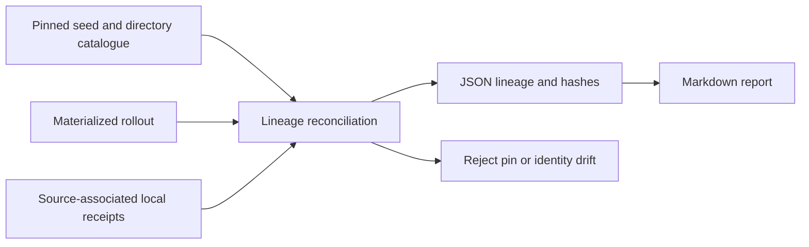
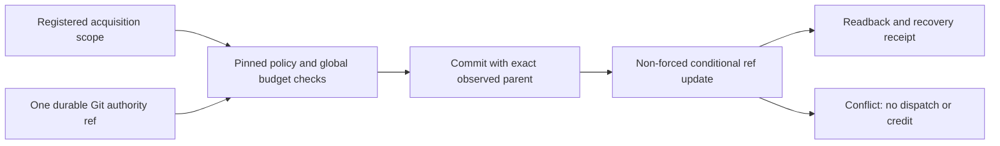

# Approved design and ownership boundary

DEC-FOI-001 assigns orchestration and public publication to `archive-govt-nz`.
`fyi-archive` remains the operational owner until verified transfer; approval
of the destination architecture is not evidence that cutover has occurred.

No extracted index replaces Bronze. Raw source metadata and its searchable
projection have distinct identities. Snapshot manifests join source/object IDs,
content hashes, parent-child relationships, original response receipts and
published revision/path; derived rows cannot point at unverified uploads.

## Logical public layout

The following is a proposed layout, finalized after inventory and size review:

- global catalogue: `countries`, `sources`, `coverage`, schema and index manifest;
- existing per-instance repositories: `indexes/`, `manifests/`, `objects/sha256/`,
  and `receipts/`, with original formats or bounded WARC packages;
- legacy historical indexes remain intact and explicitly labelled discovery;
- raw shard/package manifests enumerate every member, byte count and SHA-256;
- public objects, metadata and catalogue entries carry reciprocal stable IDs.

Publish immutable payloads first, verify them, then promote indexes referencing
that exact revision. A failed upload/verification cannot advance the public
current-snapshot pointer. Prove interrupted publication and idempotent resume.
Only approved public fields reach catalogue exports; restricted metadata can
itself be sensitive even when raw payload publication is blocked.

## Safe lease recovery

Compare ledger revision, lease identity and owner-run state before release.
Successful runs require receipt reconciliation before crediting coverage.
Failed/cancelled terminal runs may be released only under the tested recovery
policy; active/unknown ownership stays fenced. State writes detect concurrent
updates. Never clear all leases or advance the cursor to skip the conflict.

## Migration

Import existing manifests/checkpoints as provenance-bearing records; do not
turn old manifest record counts into new raw-capture receipts. Reuse retained
captures for shadow comparison to avoid double source load. Export resumable
checkpoints and verify rollback before transferring the scheduler. Leave donor
code/history and public dataset identities intact. Fix donor-side incidents in
bounded scoped patches while it remains the active operational owner.

## Global rollout

P2.10 reuses the lineage reconciler to assess every additional candidate's
retained evidence, then validates an explicit bounded observation cohort.
The AL/BH cohort preserves selected HTML title/link metadata and in-memory body
digests, not original HTML payloads. Full robots text is retained as a small
policy input. The offline assessor verifies identity, hashes, anonymous GET
metadata, same-site redirects and endpoint links. A register-labelled landing
page with distinct year-labelled links establishes that narrow interface;
it does not establish record contents, coverage or redistribution rights.
The default-agent robots result is independent of source access and rights.
Reported restrictive privacy/dispositions retain their status and omit URLs.
No observation changes the seed catalogue, rollout, schedules or publisher.

P2.9 adds a read-only lineage projection from the byte-verified seed/directory
catalogue, the materialized rollout and contained source-associated receipts.
It reuses rollout integrity checks, requires the exact catalogue pin and source
membership, then emits paired local JSON/Markdown reports. Source IDs found
only in the rollout are candidates outside the pinned catalogue. Hashes bind
receipt bytes without adopting their assertions. No source configuration,
schedule, publication state or reviewed-coverage count is changed.

The country universe is versioned; territories and the EU are separate entities.
For every country: discover named public sources, assess adapter/rights/pacing,
perform a bounded capture and restore, then enable backlog and incremental
schedules. Unsupported or blocked sources remain visible; adding a country
never silently activates arbitrary source URLs or creates a false 100% metric.

## Additional operational safeguards

- A top-level snapshot pins each per-instance repository revision and manifest
  digest. Promotion validates all references; a partial country upload leaves
  the prior valid snapshot discoverable. Old readers keep a consistent view.
- Export accepted raw bytes, manifests and checkpoints to durable storage before
  temporary Actions artifacts expire. Reconcile the oldest expiring batches
  first; do not replay sources merely because a temporary transport artifact vanished.
- A shared owner generation or equivalent durable fence spans both repositories.
  GitHub workflow concurrency within one repository is insufficient. A stale
  donor process must be unable to reserve work or publish after transfer.
- Restore from a pinned public snapshot and exported state in a clean environment,
  with no local cache. During an HF outage retain durable pending work, back off,
  and never mark uploads verified. State the measured recovery time and data-loss
  window; do not promise unmeasured availability.
- Treat source URLs, redirects, MIME types and attachments as untrusted. Block
  private-network destinations; do not execute active content. Bound archive
  expansion, member paths and parser resources. Retain eligible originals in
  isolation while quarantining unsafe files from public delivery.
- Configure per-source/global byte, request, runtime and retry budgets. Shard
  manifests and raw packages for bounded downloads; preserve object identifiers
  when compacting. Model queue age/fairness and storage growth, not only row counts.

## Shared execution deployment increment — 2026-08-31

Use existing GitHub Git objects and one metadata-only authority ref, not copied
SQLite files. Every state mutation creates a commit with the exact observed
head as its sole parent; a non-forced ref update rejects competing writers.
All source queues share the same ref so a reservation can bind its global
budget and origin checks to one snapshot. Missing authority requires explicit
bootstrap, never automatic recreation. The branch is not a raw-data store.

Scoped institutional pilots do not transfer the donor request queue. Hosted
rehearsal verifies persistence and conflict behavior before real scope admission.
Capture, publication, and cutover remain distinct. Delayed donor jobs cannot be
claimed fenced at a publication sink until they use this authority and the sink
serializes or conditionally rejects stale-owner writes. Privileged force-push,
branch deletion, malicious application code and GitHub service durability are
not solved by an optimistic CAS API. No new paid service is introduced.

## P2.13 guard correction

Every hop now shares a locked per-origin maximum learned robots delay; the earlier
one-off sleep was insufficient for redirects. The offline assessor binds media and
outcome to the terminal response with only an explicit observed plain-text to
non-HTML conversion. Duration/count inputs fail before collection if nonfinite,
mistyped or outside hard count caps. Historical collector bytes remain in an inert
track snapshot; observation hashes and earlier reports remain unchanged. See the
dated correction for the confirmed Italy pacing breach; no replay is implied.
