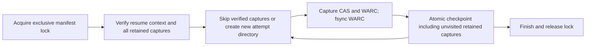

# Phase 2.1 — fiscal capture checkpoint and WARC preservation

Local-only follow-up to `0cf0f32b635d484989bab815ba40e2e6446a0133` in the
same isolated worktree. No parent, registry, source-census, rights decision,
Phase 2.4 or Phase 3 changes. No network acquisition or full harness.

## Contract and compatibility

The actual fiscal runner now writes its manifest atomically after each attempt.
Explicit `--resume` requires the same census bytes and resource-size budget,
unique selected source IDs, and verifies every retained captured row before any
network request: request URL hash, recorded rights tuple, CAS SHA-256/BLAKE3/size,
and WARC SHA-256 at a contained relative path. Only verified captures are skipped;
failed attempts are retried. Skipping an observation is not a new observation
of an unchanged live source. A fresh observation uses a new manifest path.

Each attempt reserves its own exclusive directory below `--warc-dir` and writes
`response.warc` there. The WARC is fsynced before checkpoint promotion. A crash
between WARC creation and checkpointing retains the unreferenced attempt; retry
uses another path, never overwriting that evidence. Source IDs are not paths.
Consumers must follow the additive `warc_path` field, not guess `<source_id>.warc`.
The existing v1 manifest fields remain; additive `capture_context`,
`request_url_sha256`, and `warc_path` provide resume bindings. Legacy manifests
without these bindings are not resumable and are not rewritten/migrated.

One exclusive `<manifest>.lock` directory fences cooperating runner instances.
Normal exceptions/cancellation release this run's lock. An existing lock fails
closed and is never automatically removed. Output manifests must be new unless
explicitly resuming. Partial/failure checkpoints are observations, not releases.
The checkpoint is trusted local operational state, not a cryptographic signature
or an adversarial/concurrently writable filesystem sandbox.



## TDD and validation

The prior characterization was changed to desired resume acceptance and failed
with `FileNotFoundError` for the absent checkpoint after cancellation. It now
proves no repeated first request, byte-identical retained WARC, complete-run
idempotence, and a fresh observation with a distinct WARC path.

Twenty additional checks cover receipt/context drift, corrupt/missing objects
and WARCs, path escape, duplicate IDs, existing manifests/locks, checkpoint
write/rename failure, retryable results, repeated interruption, and the real
empty-selection CLI entrypoint. The new runner and existing Bronze file contain
43 passing cases; the affected generic/Health suite has 149 passing tests.
Runner coverage: 133/133 lines, 30/30 branches (100%). Ruff lint/format and
basedpyright pass. Four in-memory guard mutants are caught: disabled retained
skip (2 failing tests), WARC fixity (2), context pin (1), and dropping unvisited
retained receipts (1). No source files were edited by mutation runs.

Bounded development failures retained: first coverage run was 89% (CLI and
duplicate-ID paths missing); a misplaced test assertion caused one NameError,
corrected before final validation. Lint complexity/exception-style findings
were resolved by extracting receipt verification and applying standard style.

Exact focused and affected commands are in `bronze-checkpoint-validation.json`.
Coverage command:

```sh
PYTHONPATH=src COVERAGE_FILE=build/health-checkpoint.coverage /Volumes/PortableSSD/GitHub/archive-govt-nz/.venv/bin/python -m coverage run --branch --source=tools -m pytest tests/domains/health_appropriations/test_capture_checkpoint.py tests/domains/health_appropriations/test_bronze_ingestion_contracts.py -q
COVERAGE_FILE=build/health-checkpoint.coverage /Volumes/PortableSSD/GitHub/archive-govt-nz/.venv/bin/python -m coverage report --include='*/tools/capture_health_resources.py' --show-missing --fail-under=95
```

## Remaining exact Phase 2.1 limits

- **Expected-length mismatch:** compressed-wire length verification remains
  unimplemented by the identity-only guard in `capture.py`.
- **Interruption/resume (M-15/AC-13):** cooperative cancellation is executable
  acceptance; hard process termination leaves a stale fail-closed lock. Safe
  stale-owner recovery and a subprocess-kill/resume contract remain missing.
  File fsync plus atomic rename is tested; directory durability across power
  loss is not claimed. Orphan WARC evidence is retained but not automatically
  reconciled into a completed capture.
- **M-18/AC-16:** the changed runner has 100% line/branch coverage, but the
  pre-existing defensive `capture.py` redirect-loop fallback remains uncovered
  as described in the preceding audit. Parent owns full integrated assurance.

The original Phase 2.1 task therefore stays `[~]`. These are executable
preservation/recovery limits, not source-census or rights-promotion gates.
Self-review found no remaining actionable defect within this bounded
cooperative-resume slice. No automatic lock deletion, source eligibility
promotion, payload publication, historical rewrite or dependency was added.
