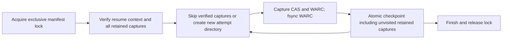

# Phase 2.1 — fiscal capture checkpoint and WARC preservation

Local-only follow-up to `0cf0f32b635d484989bab815ba40e2e6446a0133` in the
same isolated worktree. No parent, registry, source-census, rights decision,
Phase 2.4 or Phase 3 changes. No network acquisition or full harness.

## Contract and compatibility

The actual fiscal runner now writes its manifest atomically after each attempt.
Explicit `--resume` requires the same census bytes and resource-size budget,
unique selected source IDs, and verifies every retained captured row before any
network request: request URL hash, recorded rights tuple, CAS SHA-256/BLAKE3/size,
and WARC SHA-256 at a contained relative path. Only verified captures are skipped;
failed attempts are retried. Skipping an observation is not a new observation
of an unchanged live source. A fresh observation uses a new manifest path.

Each attempt reserves its own exclusive directory below `--warc-dir` and writes
`response.warc` there. The WARC is fsynced before checkpoint promotion. A crash
between WARC creation and checkpointing retains the unreferenced attempt; retry
uses another path, never overwriting that evidence. Source IDs are not paths.
Consumers must follow the additive `warc_path` field, not guess `<source_id>.warc`.
The existing v1 manifest fields remain; additive `capture_context`,
`request_url_sha256`, and `warc_path` provide resume bindings. Legacy manifests
without these bindings are not resumable and are not rewritten/migrated.

One exclusive `<manifest>.lock` directory fences cooperating runner instances.
Normal exceptions/cancellation release this run's lock. An existing lock fails
closed and is never automatically removed. Output manifests must be new unless
explicitly resuming. Partial/failure checkpoints are observations, not releases.
The checkpoint is trusted local operational state, not a cryptographic signature
or an adversarial/concurrently writable filesystem sandbox.



## TDD and validation

The prior characterization was changed to desired resume acceptance and failed
with `FileNotFoundError` for the absent checkpoint after cancellation. It now
proves no repeated first request, byte-identical retained WARC, complete-run
idempotence, and a fresh observation with a distinct WARC path.

Twenty additional checks cover receipt/context drift, corrupt/missing objects
and WARCs, path escape, duplicate IDs, existing manifests/locks, checkpoint
write/rename failure, retryable results, repeated interruption, and the real
empty-selection CLI entrypoint. The new runner and existing Bronze file contain
43 passing cases; the affected generic/Health suite has 149 passing tests.
Runner coverage: 133/133 lines, 30/30 branches (100%). Ruff lint/format and
basedpyright pass. Four in-memory guard mutants are caught: disabled retained
skip (2 failing tests), WARC fixity (2), context pin (1), and dropping unvisited
retained receipts (1). No source files were edited by mutation runs.

Bounded development failures retained: first coverage run was 89% (CLI and
duplicate-ID paths missing); a misplaced test assertion caused one NameError,
corrected before final validation. Lint complexity/exception-style findings
were resolved by extracting receipt verification and applying standard style.

Exact focused and affected commands are in `bronze-checkpoint-validation.json`.
Coverage command:

```sh
PYTHONPATH=src COVERAGE_FILE=build/health-checkpoint.coverage /Volumes/PortableSSD/GitHub/archive-govt-nz/.venv/bin/python -m coverage run --branch --source=tools -m pytest tests/domains/health_appropriations/test_capture_checkpoint.py tests/domains/health_appropriations/test_bronze_ingestion_contracts.py -q
COVERAGE_FILE=build/health-checkpoint.coverage /Volumes/PortableSSD/GitHub/archive-govt-nz/.venv/bin/python -m coverage report --include='*/tools/capture_health_resources.py' --show-missing --fail-under=95
```

## Follow-up contract — encoded transfer-length mismatch (25 September 2026)

The earlier expected-length limitation is now covered at the shared capture
boundary. A streamed gzip response whose decoded payload is complete but whose
declared wire `Content-Length` is one byte too large must fail with
`length_mismatch`; the contract verifies the stream is consumed once and closed,
no CAS object or temporary file is promoted, and no WARC is written. The
existing exact gzip, empty, identity, and absent-length boundary cases remain
green. This verifies the observable mismatch path; cached compressed responses
with no raw wire count still fail closed as `wire_length_unverifiable`.

Focused validation: `uv run --locked pytest -q
tests/domains/health_appropriations/test_bronze_ingestion_contracts.py -k
'length'` (7 passed), plus Ruff lint and format checks for the changed test.
The full repository harness passed before hosted delivery.

## Follow-up contract — hard process termination (25 September 2026)

The runner's SQLite exclusive lock is released by the kernel when its owning
process is killed. A subprocess acceptance test now holds the actual runner
lock helper, proves a competing owner is rejected, kills the owner, and proves
a new owner can acquire the same lock file. The lock inode remains present and
is never unlinked or replaced. This disproves the earlier stale-lock concern;
it does not imply that a completed WARC from an interrupted checkpoint is
automatically reconciled on resume.

Focused validation: `tests/domains/health_appropriations/test_capture_checkpoint.py`
(28 passed), Ruff lint/format, and strict basedpyright passed. The full
repository harness is run for this follow-up before hosted delivery.

## Remaining exact Phase 2.1 limits

- **Interruption/resume (M-15/AC-13):** hard process termination and subsequent
  lock reacquisition are executable acceptance. File fsync plus atomic rename
  is tested; directory durability across power loss is not claimed. Orphan
  WARC evidence is retained but not automatically reconciled into a completed
  capture.
- **M-18/AC-16:** the changed runner has 100% line/branch coverage, but the
  pre-existing defensive `capture.py` redirect-loop fallback remains uncovered
  as described in the preceding audit. Parent owns full integrated assurance.

## Follow-up contract — durable observation and version history (26 September 2026)

Each non-retained resource attempt now appends a deterministic observation event
to the capture manifest. Events retain bounded status/outcome entries, UTC
observation time, and, for successful captures, the CAS identity, immutable
attempt WARC path and digest, and ETag/Last-Modified when present. Validator
absence is explicit. Resume carries prior events forward, while prior WARC
attempt directories are never overwritten. Existing v1 result consumers remain
compatible because the event list and result fields are additive.

Offline tests prove a retry observation survives resume, subsequent successful
observations are retained, changed payloads have distinct fixity, validators
are bound to the right WARC response, and old WARC bytes remain available.
Focused checkpoint suite: 29 passed. `./scripts/validate.sh`: 6,853 passed,
9 skipped, 98.06% coverage; 48 schemas, 9/9 differential parity and all
configured mutation/supply-chain checks passed.

This implements local attempt/source-version history. It does not implement a
scheduled heartbeat/discovery lane, does not prove that a source remains
current between captures, and does not automatically reconcile orphan WARCs
left between WARC fsync and manifest checkpoint promotion.

The original Phase 2.1 task therefore stays `[~]`. These are executable
preservation/recovery limits, not source-census or rights-promotion gates.
Self-review found no remaining actionable defect within this bounded
cooperative-resume slice. No automatic lock deletion, source eligibility
promotion, payload publication, historical rewrite or dependency was added.
