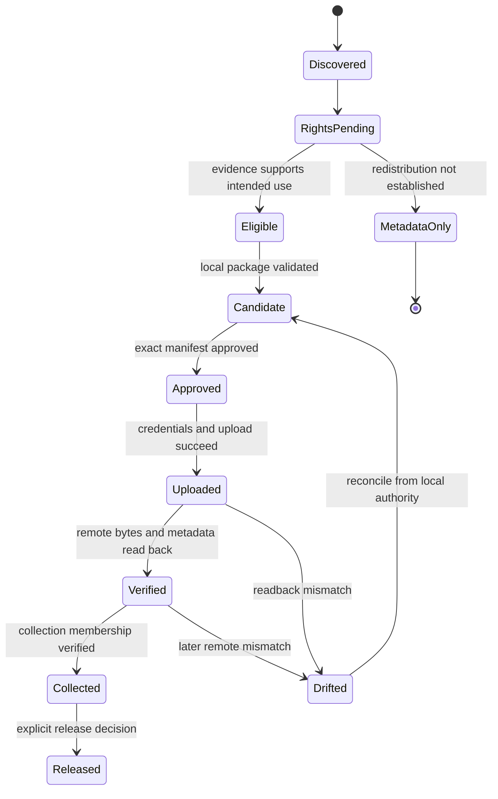
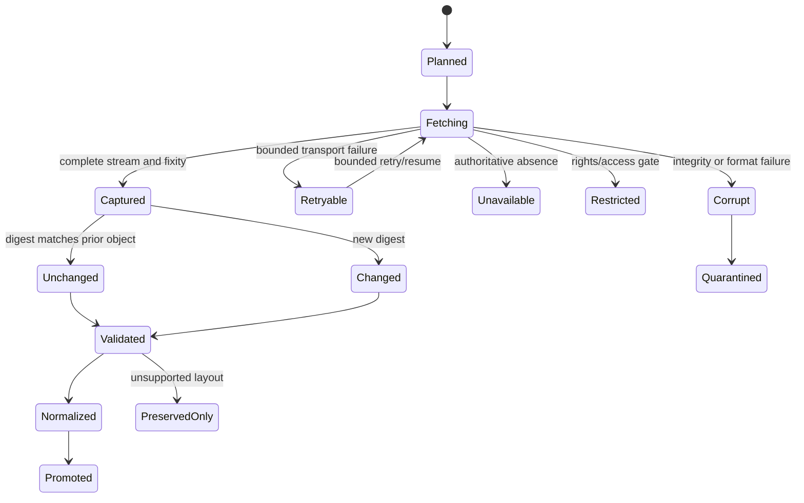

# Design: New Zealand Health Appropriations Medallion Assimilation

## Source-derived analytical boundary

The bounded Ministry HAIR2024 CSV path emits a distinct
`published_indicator_fact` recordset. Supplied real/nominal/per-capita labels
are preserved without claiming independent reproduction; omitted units, price
base, denominator and exact fiscal dates remain null with explicit quality
flags. These records cannot silently replace calculated Gold measures. The
shared exclusive writer retains original-derived lineage and interrupted
partial outputs; see [Ministry indicator contracts](./moh-indicators.md).

Pure historical/Budget calculations preserve exact values and IDs, partition
sources/vintages, and make period/basis gaps and missing/invalid denominators
explicit. Percentages have an independent Decimal rounding policy; missing
values stay null. See [analytical contracts](./raw-analytics.md). File verification
and exclusive Gold persistence remain distinct from pure computation.

## Design goals

The design makes original bytes durable, transformations reconstructable,
fiscal vintages explicit, publication fail-closed, and every analytical result
traceable to source locations. It extends the repository's existing medallion
contracts instead of building a donor-specific sidecar pipeline.

## System and trust boundaries

```mermaid
flowchart LR
    subgraph U[Untrusted and externally mutable sources]
      D[Donor Git repository]
      T[Treasury and Budget sites]
      H[Ministry of Health]
      P[Pharmac]
      S[Stats NZ]
    end

    subgraph B[Bronze - authoritative preservation]
      O[Immutable CAS objects outside Git]
      W[WARC and observation receipts]
      M[Versioned manifests, rights and fixity]
    end

    subgraph V[Validated transformation boundary]
      I[Workbook, CSV, PDF and SQLite inventory adapters]
      Q[Quarantine, tombstone and reason-coded gaps]
    end

    subgraph SI[Silver - source-faithful typed records]
      R[Multi-recordset Parquet]
      L[Field and cell lineage]
      C[Vintage, unit and classification dimensions]
    end

    subgraph G[Gold - rebuildable analytics]
      A[DuckDB models and quality reports]
      X[SQLite compatibility export]
      Z[Deterministic plots and extracts]
    end

    subgraph PL[Platinum - governed projections]
      MD[DCAT, Croissant, RO-Crate, PROV and cards]
      F[Federation and search projections]
      RC[Rights-filtered release candidate]
    end

    subgraph E[External publication boundary]
      HF[Hugging Face dataset]
      COL[HEOR collection]
    end

    D --> O
    T --> O
    H --> O
    P --> O
    S --> O
    O --> W --> M
    M --> I
    I -->|valid and supported| R
    I -->|unsupported, restricted or corrupt| Q
    O --> L
    R --> L
    R --> C --> A
    L --> A
    A --> X
    A --> Z
    A --> MD
    L --> MD
    MD --> F
    MD --> RC
    RC -->|explicit hash-bound approval and credentials| HF
    HF -->|remote readback| COL
```

### Original-workbook orchestration

The local rebuild command preflights all four known source paths in a
hash-pinned donor manifest and verifies each CAS object before creating output.
One explicit observation timestamp and versioned profile map define the run.
Every run has an exclusively created directory; adapters retain their distinct
schemas and never concatenate unlike record sets. The completion manifest pins
each stage manifest and output hash. Reusing a complete run requires matching
plan identity and full fixity verification. An interrupted or partial run is
retained, not overwritten; retry uses a new directory. This initial complete-run
idempotence contract does not yet claim partial-stage scheduling/resumption.
Structured failure receipts contain stable error classes, not source text or
credentials. No Bronze write, Gold replacement or publication occurs.

Read-only verification is a separate operation, never a call to the rebuild
function. Consumers supply the exact run-manifest SHA-256. Verification checks
that pin before and after inspecting the plan, source CAS objects and all
stage outputs. CLI and MCP share this non-mutating library contract. Missing
or incomplete runs remain missing/incomplete; inspection cannot start work.

Workbook inspection reads one size-capped, hash-verified snapshot. Existing
package/traversal contracts inventory all sheets; bounded previews decode
only a requested head rectangle, without evaluating formulas. Preview values
are labelled decoded displays, not canonical numeric facts. Sheet selection,
row/column limits and an aggregate preview-cell cap bound output. No original
or cached formula value is rewritten, and failures cross the CLI boundary as
redacted classes rather than unstructured source diagnostics.

External bytes are untrusted until streamed, bounded, hashed and recorded.
Bronze objects are authoritative for preservation. All later stores and
indexes are rebuildable. Hugging Face is an external publication target, not
the only preservation copy.

## Layer contracts

| Layer | Authoritative input | Principal output | Promotion gate | Rebuildable? |
| --- | --- | --- | --- | --- |
| Bronze | observed external bytes and donor Git objects | CAS objects, WARC, manifests, rights/fixity/heartbeat receipts | complete byte count, digest and disposition | source-dependent; retained as authority |
| Silver | Bronze objects plus versioned adapter | typed multi-recordset Parquet and field lineage | schema, loss-accounting, unit/vintage and quality checks | yes |
| Gold | Silver records plus versioned transformations | DuckDB models, Parquet marts, SQLite, reports and plots | parity, reconciliation, determinism and query invariants | yes |
| Platinum | Bronze/Silver/Gold manifests and rights state | metadata, cards, federation/search and release candidate | metadata validation, rights and release-readiness gates | yes |
| Published | approved Platinum candidate | HF revision and collection membership | checksum-pinned approval, credentials and remote verification | mirrored from candidate |

## Bronze object and observation model

Each immutable object is keyed by SHA-256 and may also carry BLAKE3 and CID.
An observation links a source locator and observation time to an object or a
reason-coded no-object state. Re-observing the same bytes creates a new
observation without duplicating the object. A changed object creates a new
version and explicit predecessor/supersession edges.

The donor import manifest records Git path, mode, blob ID, byte length, object
hash, donor commit/tree and deterministic Git-archive hash. It covers all 23
paths; source data, donor derivatives, code, documents and images are not
selectively omitted.

For ZIP-based workbooks, extraction reads from the preserved package but does
not rewrite it. Package-part inventory can describe formulas, cached values,
styles, relationships, charts, macros and embedded objects while leaving the
original bytes untouched.

Workbook inventory rejects platform-ambiguous member paths and duplicate ZIP
parts before parsing. Existing 20,000-member and 512 MiB expanded-package limits
are supplemented by a cumulative 2,000,000-cell rectangular traversal budget
before formula counting. The cell gate bounds traversal after workbook loading,
not all parser allocation. Rejection leaves Bronze bytes intact and does not
claim that an unsupported workbook was normalized.

The additive `archive-govt-nz.workbook-inventory/v1` output retains the previous
counts and adds sorted package-member names, global and sheet-scoped defined
names, worksheet dimensions, merged/table ranges, formula/comment coordinates
and hidden row/column spans. Formula and comment content is not exported or
evaluated. For formula coordinates only, a second data-only view of the immutable
Bronze workbook records cached-result type and `stored_value`, `stored_error`,
or `missing_or_empty` state. Absent and empty caches are combined because the
reader represents both as null; zero and false remain stored values. Cache
contents are not exported, and `formula_cache_freshness: not_verified` makes
clear that cache presence does not establish freshness or correctness. Workbooks
without formulas skip this second load. Neither view rewrites source bytes.
Unknown package parts are listed without interpreting their payloads. External
workbook references are counted from preserved relationship metadata without
retrieving their targets or exporting target URLs. Embedded/opaque payloads
remain exclusively in the original package. The legacy `has_macros` field is
an exact, case-insensitive `vbaProject.bin` basename marker, not proof of valid
or executable VBA, a full active-content detector, or a safety verdict.
This inventory supports
loss accounting but does not itself claim normalization or source completeness.

## Silver domain model

The additive [record-set registry](./recordset-contracts.md) specifies eight
versioned structural Arrow shapes without rewriting source-specific v1 tables.
Its bounded Decimal128 carrier preserves representable source values; future
projections must reject overflow, retain source precision and prove semantic
and lineage closure. Unknown valid times are nullable, not invented from year
tokens. Structural schema availability is not canonical source promotion.

All records share:

- `record_id`, `schema_version`, `recordset` and `domain`;
- `source_object_sha256`, `source_observation_id`, `source_locator` and
  `source_vintage`;
- `valid_time_start`, optional `valid_time_end`, and `observed_at`;
- `rights_state`, `quality_flags`, `transformation_id` and `lineage_id`.

### Record sets and stable keys

| Record set | Example stable key components | Important semantics |
| --- | --- | --- |
| `source_inventory` | object + member/sheet/page/range | coverage, formulas, hidden/unsupported content, disposition |
| `appropriation_fact` | vote + appropriation + department + amount type + financial year + vintage | NZD thousands/millions, estimates versus actuals, multi-category handling |
| `health_spending_fact` | series + financial year + vintage | nominal/real status, fiscal boundary and institutional coverage |
| `fiscal_context_fact` | measure + year/quarter + vintage | GDP and Crown expense definitions, forecasts versus observations |
| `pharmaceutical_budget_fact` | measure + period + vintage | CPB scope and policy/budget period |
| `price_population_fact` | measure + period + geography + vintage | CPI base, wage measure, population definition and seasonality |
| `classification_dimension` | scheme + source label + effective period | mapping version, confidence and drift |
| `field_lineage` | record + field + source coordinate | source cell/range/page, raw value, normalized value and rule |

Missing values distinguish source blank, not applicable, suppressed,
unparseable and absent. Monetary values use fixed-precision decimals at the
declared source unit; presentation rounding occurs only in downstream views.

### Workbook extraction strategy

Adapters are source-family and schema-fingerprint aware:

1. inventory package parts, workbook properties, sheets and dimensions;
2. detect known tables/ranges using labels and structural constraints;
3. retain formula text and cached values distinctly when available;
4. emit raw cell coordinates and typed candidate values;
5. normalize only after unit, header and period validation;
6. reconcile totals and expected row/column constraints; and
7. emit records or a reason-coded exclusion/failure receipt.

No positional heuristic is accepted without a fixture and layout fingerprint.
An unseen layout fails closed for normalization but remains preserved in
Bronze and visible in the inventory.

## Source-specific Silver extraction

### Historical source precision and period contract

Historical extraction reads literal numeric tokens from the validated OOXML
package, not a binary-float round trip or the workbook's display format.
The historical record-set schema uses decimal128(38,17), with exact conversion
only; values outside that precision/range receive a rejection, never rounding.
The original lexical token and number format remain alongside the typed value.
This is a separately versioned derivative; existing decimal128(20,3) products
and published files are not rewritten.

Known Health/GDP currency blocks are distinct from percentage-of-GDP blocks.
Year annotations retain marker-to-footnote links. Source labels establish
March/June year-end context; old-GAAP inherits the preceding June context with
explicit lineage while changing accounting basis. No annual start date or
cross-series comparability is inferred. Row-level reconciliation retains donor
values, source values and reasons for omissions/precision differences rather
than using the donor as a source-coverage filter.

### Raw forecast summary increment

The BEFU/HYEFU adapter shares verified-snapshot, exact-number, source-context
and non-overwriting output helpers with the Budget adapter. Source-specific
layout selection remains separate: an exact unique `Health` label, the nearest
preceding same-column `($millions)` label, contiguous consecutive year columns
on the row above the units, and explicit Actual/Forecast labels. Unknown or
ambiguous layouts fail closed rather than selecting the donor's first fuzzy
label match. Forecast-to-Actual reversal within ascending years is rejected.

Only literal selected amounts become facts. Each fact has source lineage for
year, amount, amount type, classification, measure and unit. The separate
formula-based detailed totals remain original content, never evaluated or
silently substituted from caches. Populated cells outside the selected summary
have `preserved_only` dispositions, and selected blank amounts have explicit
rejections. Blank cells outside the selected inputs are not data observations;
their worksheet extents remain represented by the structural inventory. Other
worksheets have explicit preservation-only exclusions.

Profiles select known BEFU/HYEFU sheet names; caller-supplied source vintage,
observation time and original locator accompany the verified object identity.
Financial-year endpoints are not inferred from bare year labels. Rights remain
unresolved until joined to resource-level rights evidence. Output completion
requires a valid manifest and matching hashes in a newly reserved directory.

## Gold analytical model

### Raw compatibility export boundary

The source-derived export verifies the entire pinned raw run and its Bronze
objects, then consumes capped hash-verified snapshots of stage facts and field
lineage. It requires unique record IDs, matching source context and exactly one
matching amount-lineage observation per fact. All facts survive projection;
legacy REAL representation differences are flagged beside exact decimal values.
Stable table/record ordering assigns explicit SQLite row numbers to sidecars.

Dry-run is read-only. Writing requires a new exclusive directory outside Bronze
and the input run. Fixed-schema SQLite, exact-value/context JSONL and complete
field-lineage JSONL receive output hashes in a versioned completion manifest.
Failure retains partial files and a redacted error-class receipt; an existing
or partial directory is never overwritten. This is local derivative creation,
not source acquisition, rights clearance, donor repair approval or HF publication.

Gold queries operate over conformed dimensions:

- financial period and source vintage;
- vote, appropriation, category, department and portfolio;
- amount type and forecast/actual status;
- functional and economic classification;
- measure, unit, price basis and denominator; and
- source/institutional coverage.

Derived measures retain numerator and denominator record IDs. Real-series
outputs retain the index series, base period and transformation formula.
Per-capita outputs retain the population definition and temporal alignment.
Revision views compare like measures by vintage; they do not overwrite or
splice vintages.

The donor SQLite database is ingested as a parity oracle, then regenerated as
a compatibility artifact from canonical Parquet. The six donor plots are
validated by query result, series/labels, units, filter choice and rendering
parameters. PNG byte identity is not required across rendering platforms,
though a pinned environment should make release builds deterministic.

## Platinum, federation and publication

### Read-only additive inventory boundary

The additive planner accepts explicit pinned base-manifest, complete-capture,
resource-rights and four versioned Silver-package inputs. It reads capped
verified snapshots, rejects duplicate JSON keys and portable path collisions,
checks every base file, and assigns separate fixed Budget-2026, CPI-2026-Q2,
BEFU-2026 and HYEFU-2025 namespaces. Each package source hash must join exactly
one capture row, resource-rights entry and original file with consistent
locator, recorded rights tuple, object identity and byte count. Symlink inputs
and members are rejected; reviewed local paths are not a concurrent-hostile
filesystem sandbox.

The output is a deterministic proposed payload inventory, not a candidate.
Package manifests retain `rights_state: not_evaluated`; recorded source rights
are evidence joins, not a new rights assessment. Semantic Parquet validation,
metadata overhead, a future candidate root manifest and publication approval
remain explicit separate gates. No files are copied and no HF call occurs.

Platinum metadata derives from actual manifests and schemas. Per-resource
rights determine whether a candidate contains an original payload, a derived
record, metadata only, or a tombstone. Dataset-level cards summarize mixed
licensing rather than replacing it.

Federation exports versioned entity and relationship tables. Candidate joins
to reimbursement and medicines atlases include namespace, identifier,
mapping method, confidence, effective period and provenance. No live sibling
database is required to rebuild this archive's products.

A release claim requires the final `Released` state. `Uploaded`, `Verified`,
and `Collected` retain distinct receipts.

## Operational state and recovery

The existing transactional SQLite ledger records discovery cursors, attempts,
retry schedule, object/observation links and publication stages. Durable
manifests and objects remain sufficient to reconstruct the analytical layers.

Partial downloads never become captured objects. Atomic writes, bounded
retries, checkpoints and idempotency keys make interrupted runs resumable.
Clean-room recovery starts with an empty derivative store and verifies output
manifest digests after rebuilding each layer.

## Dependency boundary

The current stack already establishes PyArrow/Polars/Parquet/DuckDB patterns.
Workbook structure and PNG plot reproduction may justify `openpyxl` and
Matplotlib. They remain behind an explicit design/dependency task: compare
available repository-compatible approaches, create focused fixtures, amend
`conductor/tech-stack.md`, update the lock, and record licence/security and
reproducibility evidence before production adoption.

## Security and privacy

The bounded embedded-notice observer consumes only three reviewed legacy
workbook hashes. It verifies a capped snapshot, checks exact metadata-cell
decoded-text hashes, and returns a non-eligibility receipt with coordinates and
digests rather than source text. It never follows relationships, modifies
Bronze or registers rights automatically; see [embedded notices](./embedded-notices.md).

Only public government fiscal and aggregate context data is intended. Every
retrieval is size-bounded and type-checked; ZIP packages receive archive-bomb
and path-safety checks. Logs and evidence retain no credentials, signed URLs,
personal information or raw restricted content. Rights and publication logic
fails closed and receives critical-logic coverage, property, mutation and
negative-path tests.

## Design decisions deferred to planned gates

- exact source inventory cutoff and immutable resource URLs after live census;
- adoption/version of workbook and plotting dependencies;
- exact Hugging Face dataset configuration/splits after schema and rights
  stabilization;
- whether aggregate Health Survey linkage has a justified analytical use case;
- whether graph or vector projections demonstrate sufficient consumer value.
