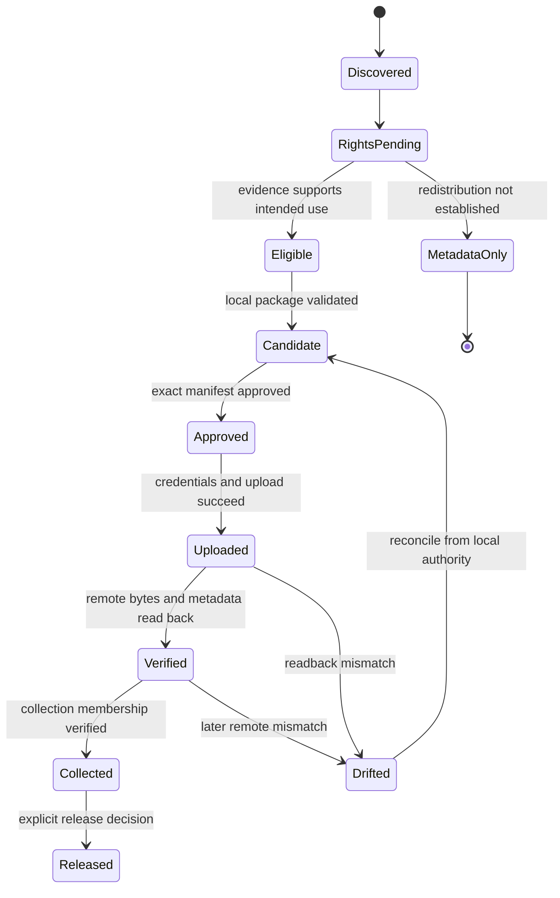
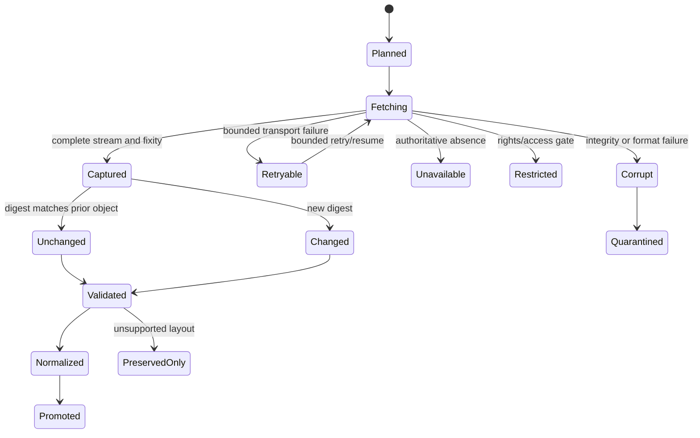

# Design: New Zealand Health Appropriations Medallion Assimilation

## Design goals

The design makes original bytes durable, transformations reconstructable,
fiscal vintages explicit, publication fail-closed, and every analytical result
traceable to source locations. It extends the repository's existing medallion
contracts instead of building a donor-specific sidecar pipeline.

## System and trust boundaries

```mermaid
flowchart LR
    subgraph U[Untrusted and externally mutable sources]
      D[Donor Git repository]
      T[Treasury and Budget sites]
      H[Ministry of Health]
      P[Pharmac]
      S[Stats NZ]
    end

    subgraph B[Bronze - authoritative preservation]
      O[Immutable CAS objects outside Git]
      W[WARC and observation receipts]
      M[Versioned manifests, rights and fixity]
    end

    subgraph V[Validated transformation boundary]
      I[Workbook, CSV, PDF and SQLite inventory adapters]
      Q[Quarantine, tombstone and reason-coded gaps]
    end

    subgraph SI[Silver - source-faithful typed records]
      R[Multi-recordset Parquet]
      L[Field and cell lineage]
      C[Vintage, unit and classification dimensions]
    end

    subgraph G[Gold - rebuildable analytics]
      A[DuckDB models and quality reports]
      X[SQLite compatibility export]
      Z[Deterministic plots and extracts]
    end

    subgraph PL[Platinum - governed projections]
      MD[DCAT, Croissant, RO-Crate, PROV and cards]
      F[Federation and search projections]
      RC[Rights-filtered release candidate]
    end

    subgraph E[External publication boundary]
      HF[Hugging Face dataset]
      COL[HEOR collection]
    end

    D --> O
    T --> O
    H --> O
    P --> O
    S --> O
    O --> W --> M
    M --> I
    I -->|valid and supported| R
    I -->|unsupported, restricted or corrupt| Q
    O --> L
    R --> L
    R --> C --> A
    L --> A
    A --> X
    A --> Z
    A --> MD
    L --> MD
    MD --> F
    MD --> RC
    RC -->|explicit hash-bound approval and credentials| HF
    HF -->|remote readback| COL
```

External bytes are untrusted until streamed, bounded, hashed and recorded.
Bronze objects are authoritative for preservation. All later stores and
indexes are rebuildable. Hugging Face is an external publication target, not
the only preservation copy.

## Layer contracts

| Layer | Authoritative input | Principal output | Promotion gate | Rebuildable? |
| --- | --- | --- | --- | --- |
| Bronze | observed external bytes and donor Git objects | CAS objects, WARC, manifests, rights/fixity/heartbeat receipts | complete byte count, digest and disposition | source-dependent; retained as authority |
| Silver | Bronze objects plus versioned adapter | typed multi-recordset Parquet and field lineage | schema, loss-accounting, unit/vintage and quality checks | yes |
| Gold | Silver records plus versioned transformations | DuckDB models, Parquet marts, SQLite, reports and plots | parity, reconciliation, determinism and query invariants | yes |
| Platinum | Bronze/Silver/Gold manifests and rights state | metadata, cards, federation/search and release candidate | metadata validation, rights and release-readiness gates | yes |
| Published | approved Platinum candidate | HF revision and collection membership | checksum-pinned approval, credentials and remote verification | mirrored from candidate |

## Bronze object and observation model

Each immutable object is keyed by SHA-256 and may also carry BLAKE3 and CID.
An observation links a source locator and observation time to an object or a
reason-coded no-object state. Re-observing the same bytes creates a new
observation without duplicating the object. A changed object creates a new
version and explicit predecessor/supersession edges.

The donor import manifest records Git path, mode, blob ID, byte length, object
hash, donor commit/tree and deterministic Git-archive hash. It covers all 23
paths; source data, donor derivatives, code, documents and images are not
selectively omitted.

For ZIP-based workbooks, extraction reads from the preserved package but does
not rewrite it. Package-part inventory can describe formulas, cached values,
styles, relationships, charts, macros and embedded objects while leaving the
original bytes untouched.

Workbook inventory rejects platform-ambiguous member paths and duplicate ZIP
parts before parsing. Existing 20,000-member and 512 MiB expanded-package limits
are supplemented by a cumulative 2,000,000-cell rectangular traversal budget
before formula counting. The cell gate bounds traversal after workbook loading,
not all parser allocation. Rejection leaves Bronze bytes intact and does not
claim that an unsupported workbook was normalized.

The additive `archive-govt-nz.workbook-inventory/v1` output retains the previous
counts and adds sorted package-member names, global and sheet-scoped defined
names, worksheet dimensions, merged/table ranges, formula/comment coordinates
and hidden row/column spans. Formula and comment content is not exported or
evaluated; cached-value semantics remain a separate contract. Unknown package
parts are listed without interpreting their payloads. This inventory supports
loss accounting but does not itself claim normalization or source completeness.

## Silver domain model

All records share:

- `record_id`, `schema_version`, `recordset` and `domain`;
- `source_object_sha256`, `source_observation_id`, `source_locator` and
  `source_vintage`;
- `valid_time_start`, optional `valid_time_end`, and `observed_at`;
- `rights_state`, `quality_flags`, `transformation_id` and `lineage_id`.

### Record sets and stable keys

| Record set | Example stable key components | Important semantics |
| --- | --- | --- |
| `source_inventory` | object + member/sheet/page/range | coverage, formulas, hidden/unsupported content, disposition |
| `appropriation_fact` | vote + appropriation + department + amount type + financial year + vintage | NZD thousands/millions, estimates versus actuals, multi-category handling |
| `health_spending_fact` | series + financial year + vintage | nominal/real status, fiscal boundary and institutional coverage |
| `fiscal_context_fact` | measure + year/quarter + vintage | GDP and Crown expense definitions, forecasts versus observations |
| `pharmaceutical_budget_fact` | measure + period + vintage | CPB scope and policy/budget period |
| `price_population_fact` | measure + period + geography + vintage | CPI base, wage measure, population definition and seasonality |
| `classification_dimension` | scheme + source label + effective period | mapping version, confidence and drift |
| `field_lineage` | record + field + source coordinate | source cell/range/page, raw value, normalized value and rule |

Missing values distinguish source blank, not applicable, suppressed,
unparseable and absent. Monetary values use fixed-precision decimals at the
declared source unit; presentation rounding occurs only in downstream views.

### Workbook extraction strategy

Adapters are source-family and schema-fingerprint aware:

1. inventory package parts, workbook properties, sheets and dimensions;
2. detect known tables/ranges using labels and structural constraints;
3. retain formula text and cached values distinctly when available;
4. emit raw cell coordinates and typed candidate values;
5. normalize only after unit, header and period validation;
6. reconcile totals and expected row/column constraints; and
7. emit records or a reason-coded exclusion/failure receipt.

No positional heuristic is accepted without a fixture and layout fingerprint.
An unseen layout fails closed for normalization but remains preserved in
Bronze and visible in the inventory.

## Gold analytical model

Gold queries operate over conformed dimensions:

- financial period and source vintage;
- vote, appropriation, category, department and portfolio;
- amount type and forecast/actual status;
- functional and economic classification;
- measure, unit, price basis and denominator; and
- source/institutional coverage.

Derived measures retain numerator and denominator record IDs. Real-series
outputs retain the index series, base period and transformation formula.
Per-capita outputs retain the population definition and temporal alignment.
Revision views compare like measures by vintage; they do not overwrite or
splice vintages.

The donor SQLite database is ingested as a parity oracle, then regenerated as
a compatibility artifact from canonical Parquet. The six donor plots are
validated by query result, series/labels, units, filter choice and rendering
parameters. PNG byte identity is not required across rendering platforms,
though a pinned environment should make release builds deterministic.

## Platinum, federation and publication

Platinum metadata derives from actual manifests and schemas. Per-resource
rights determine whether a candidate contains an original payload, a derived
record, metadata only, or a tombstone. Dataset-level cards summarize mixed
licensing rather than replacing it.

Federation exports versioned entity and relationship tables. Candidate joins
to reimbursement and medicines atlases include namespace, identifier,
mapping method, confidence, effective period and provenance. No live sibling
database is required to rebuild this archive's products.

A release claim requires the final `Released` state. `Uploaded`, `Verified`,
and `Collected` retain distinct receipts.

## Operational state and recovery

The existing transactional SQLite ledger records discovery cursors, attempts,
retry schedule, object/observation links and publication stages. Durable
manifests and objects remain sufficient to reconstruct the analytical layers.

Partial downloads never become captured objects. Atomic writes, bounded
retries, checkpoints and idempotency keys make interrupted runs resumable.
Clean-room recovery starts with an empty derivative store and verifies output
manifest digests after rebuilding each layer.

## Dependency boundary

The current stack already establishes PyArrow/Polars/Parquet/DuckDB patterns.
Workbook structure and PNG plot reproduction may justify `openpyxl` and
Matplotlib. They remain behind an explicit design/dependency task: compare
available repository-compatible approaches, create focused fixtures, amend
`conductor/tech-stack.md`, update the lock, and record licence/security and
reproducibility evidence before production adoption.

## Security and privacy

Only public government fiscal and aggregate context data is intended. Every
retrieval is size-bounded and type-checked; ZIP packages receive archive-bomb
and path-safety checks. Logs and evidence retain no credentials, signed URLs,
personal information or raw restricted content. Rights and publication logic
fails closed and receives critical-logic coverage, property, mutation and
negative-path tests.

## Design decisions deferred to planned gates

- exact source inventory cutoff and immutable resource URLs after live census;
- adoption/version of workbook and plotting dependencies;
- exact Hugging Face dataset configuration/splits after schema and rights
  stabilization;
- whether aggregate Health Survey linkage has a justified analytical use case;
- whether graph or vector projections demonstrate sufficient consumer value.
