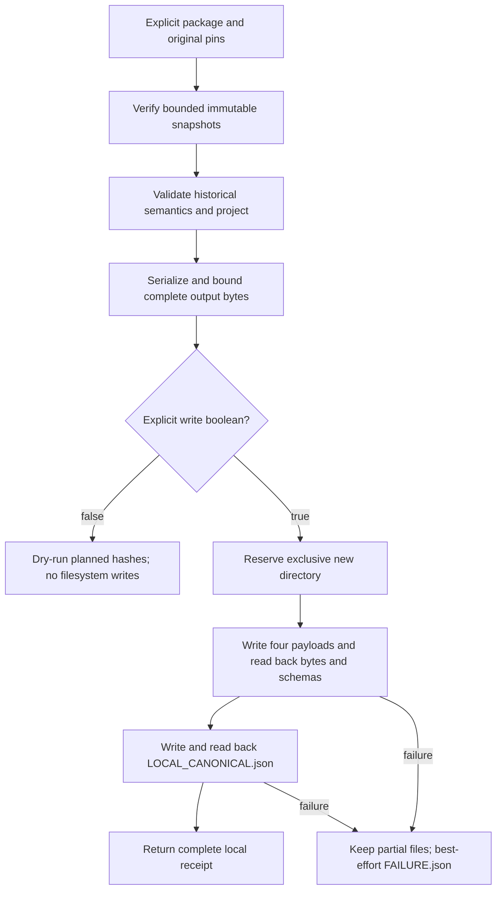

# Exclusive local historical canonical export

Bounded M-05/M-06/M-07/M-16 increment: compose the historical snapshot reader
and pure historical projection. One reviewed package/vintage per call; no
source acquisition, original rewrite, candidate creation, Gold aggregation,
rights assessment or HF publication. The original package remains necessary for
retained-only fields and dispositions.

## Contract and failure boundaries

- `write` must be an actual boolean; default false. Dry-run performs the same
  bounded serialization and completion-marker budget as write mode. Its hashes
  are explicitly `planned_outputs`, not persisted `outputs`.
- Output parent must already exist; direct output/parent symlinks, existing
  destinations and overlap with the package/original are rejected. Parent
  directory trust remains the caller's responsibility, not a filesystem sandbox
  or discovery of every publisher/Bronze root.
- Output is three exact canonical Parquet tables, complete original-lineage
  accounting JSON, and a distinct `LOCAL_CANONICAL.json` marker. Aggregate
  payload plus marker bytes must fit 128 MiB before any directory is reserved.
- Fixed ASCII filenames, canonical UTF-8/LF JSON and pinned Parquet options
  have no output-path or newly generated timestamp. Original observation times
  remain source context, not an export clock.
- Readback compares complete bounded bytes, Parquet table/schema identity and
  exact file membership. Marker existence alone never establishes validity.
- An owned partial output is never overwritten, retried or deleted. A failed
  marker remains preserved. Operational failures receive a bounded error-class
  receipt where possible; receipt failure does not mask the original failure.
  A raced, unowned directory gets no failure receipt. Interrupts propagate.
- Snapshot fixity and historical-profile semantics are separate receipt fields;
  neither implies acquisition completeness, general M-05/M-06 completion,
  accounting-basis comparability, rights qualification or publication approval.

Reader dependency PR #303 was observed merged at
`20610983e96f7768f3b173b60166afae429d7f0a`, exact head `42f40347`, after seven
successful checks. Projection delivery remains separately tracked in PR #305.

## Local assurance

Initial pytest execution preceded completion of the independent environment
setup and exited 127; no test ran. After setup, the expected missing-module red
phase exited 2. Initial implementation passed two integration tests. Hardening
expanded to 48 tests, then two dry-run budget/hash-parity tests failed before the
shared serialization preparation was added. A short-write test's initial
`bytes` override annotation was corrected to the stream's `Buffer` contract;
this was a typing correction, not a threshold exception.

Current focused result: 52 tests, including canonical encoding property checks,
pass; 100% of 77 statements and 14 branches covered. Ruff and targeted typing
pass. Independent read-only review reported no actionable finding after the
dry-run refinement. Cold unfiltered mutation passed 41/41 mutants in 51.89
seconds, with one worker and zero survivors, timeouts, errors, pardons or cache
hits. All 52 tests were selected; the default 30-second deadline was unchanged.
The coverage-collection warning did not enable coverage filtering. Native
assurance remains pending at this checkpoint.

Source SHA-256: `5b6399de889645f2c30a199b84efe07b1771a59f313d97adf7d8108243fc21a0`.
Test SHA-256: `82ac37c14edf60ad84af036ac6f265e61953881ca205bcf71096c50445186d25`.
Critical coverage receipt SHA-256:
`b2ccbfa3dd53c86b40cb7b6123e7e67d81e24ae2529483c6ddf629d9efd27bc5`.
Mutation receipt SHA-256:
`812b63804573167146de76c1987e86ba6ded36ad38deb659cc2c0dbac4103843`.

## Local retained-source pilots

Both pinned historical packages were exported twice into new directories under
`/tmp/health-canonical-export-pilot.qjiPfA`. Each dry-run's planned hashes matched
its subsequent complete output. Both pairs were byte-identical; original
workbook and source package hashes remained unchanged. These are new local
derivatives, not a publication candidate or changes to earlier derivatives.

| Package | Files per build | Bytes per build | Marker SHA-256 |
| --- | --- | --- | --- |
| raw-historical-20260830-v1 | 5 | 356830 | `f97874a46cc3b9aa6b0623c208a48861d0491695ceae731726e249587d6aea54` |
| raw-historical-2025-20260831-v1 | 5 | 363811 | `0bb6bd598ad3bc58c103251f4711e0092a75ec0ae80f63c89c623b93c0711507` |

The outputs contain 53/53 Health/GDP facts and 1007 canonical lineage rows for
the earlier package; 54/54 facts and 1026 lineage rows for the later one. Source
manifest pins are unchanged from `historical-projection.md`. Pilot receipt
SHA-256: `1000b0bc03fc6889f8398e1c3a79010a1c68d9ad629f3a2d7b075776984a75f9`.

## Independent local preservation audit

The coordinating agent verified SHA-256 and sizes for 73 capture entries
(38,877,606 bytes), 23 donor entries (6,604,301 bytes) and 94 v4 candidate
payloads (39,390,246 bytes). It also verified 73 pinned WARC files
(38,915,034 bytes), exactly one response each, with decoded body hashes and
lengths matching CAS originals. Audit script SHA-256:
`a364465d8191795d427c8e7e5ec3bbba647c626e52bfb73db8570b68862fc335`.
The capture and candidate manifests were independently pinned; donor manifest
`893f387e1f361400285ccc84802b497e87802d1ad913826ff7d9055b07a03b74`
was observed rather than independently pinned. This is local preservation
evidence only: no remote/HF access, source-semantic revalidation, rights change
or archive write is claimed.
