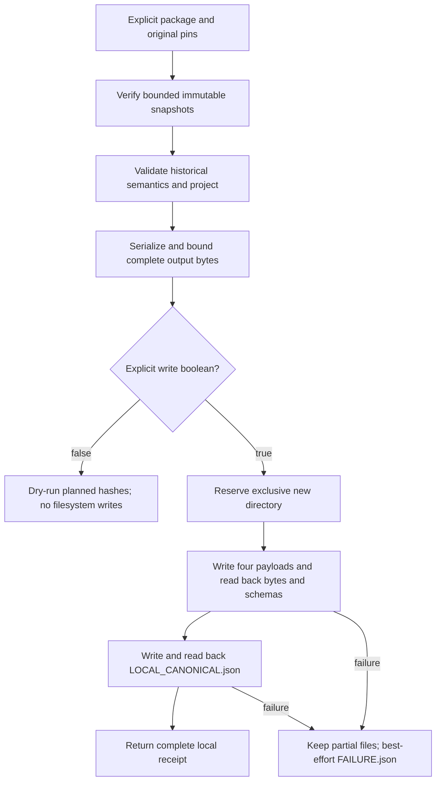

# Exclusive local historical canonical export

Bounded M-05/M-06/M-07/M-16 increment: compose the historical snapshot reader
and pure historical projection. One reviewed package/vintage per call; no
source acquisition, original rewrite, candidate creation, Gold aggregation,
rights assessment or HF publication. The original package remains necessary for
retained-only fields and dispositions.

## Contract and failure boundaries

- `write` must be an actual boolean; default false. Dry-run performs the same
  bounded serialization and completion-marker budget as write mode. Its hashes
  are explicitly `planned_outputs`, not persisted `outputs`.
- Output parent must already exist; direct output/parent symlinks, existing
  destinations and overlap with the package/original are rejected. Parent
  directory trust remains the caller's responsibility, not a filesystem sandbox
  or discovery of every publisher/Bronze root.
- Output is three exact canonical Parquet tables, complete original-lineage
  accounting JSON, and a distinct `LOCAL_CANONICAL.json` marker. Aggregate
  payload plus marker bytes must fit 128 MiB before any directory is reserved.
- Fixed ASCII filenames, canonical UTF-8/LF JSON and pinned Parquet options
  have no output-path or newly generated timestamp. Original observation times
  remain source context, not an export clock.
- Readback compares complete bounded bytes, Parquet table/schema identity and
  exact file membership. Marker existence alone never establishes validity.
- An owned partial output is never overwritten, retried or deleted. A failed
  marker remains preserved. Operational failures receive a bounded error-class
  receipt where possible; receipt failure does not mask the original failure.
  A raced, unowned directory gets no failure receipt. Interrupts propagate.
- Snapshot fixity and historical-profile semantics are separate receipt fields;
  neither implies acquisition completeness, general M-05/M-06 completion,
  accounting-basis comparability, rights qualification or publication approval.

Reader dependency PR #303 was observed merged at
`20610983e96f7768f3b173b60166afae429d7f0a`, exact head `42f40347`, after seven
successful checks. Projection delivery remains separately tracked in PR #305.

## Local assurance

Initial pytest execution preceded completion of the independent environment
setup and exited 127; no test ran. After setup, the expected missing-module red
phase exited 2. Initial implementation passed two integration tests. Hardening
expanded to 48 tests, then two dry-run budget/hash-parity tests failed before the
shared serialization preparation was added. A short-write test's initial
`bytes` override annotation was corrected to the stream's `Buffer` contract;
this was a typing correction, not a threshold exception.

Current focused result: 52 tests, including canonical encoding property checks,
pass; 100% of 77 statements and 14 branches covered. Ruff and targeted typing
pass. Independent read-only review reported no actionable finding after the
dry-run refinement. Cold unfiltered mutation passed 41/41 mutants in 51.89
seconds, with one worker and zero survivors, timeouts, errors, pardons or cache
hits. All 52 tests were selected; the default 30-second deadline was unchanged.
The coverage-collection warning did not enable coverage filtering. Native
`./scripts/validate.sh` then passed on integrated source checkpoint `a20393c`
(with documentation updated afterward): 3,194 tests, eight existing warnings,
97.15% overall coverage, all schema/parity/repository mutation, hygiene, audit,
licence, secret and SBOM gates; 111 SBOM components. Test stage took 95.82
seconds. Python 3.14.6/uv 0.11.8 used an independent environment, ctrace,
disabled JIT and four xdist workers. This is local, not hosted assurance.

Source SHA-256: `5b6399de889645f2c30a199b84efe07b1771a59f313d97adf7d8108243fc21a0`.
Test SHA-256: `82ac37c14edf60ad84af036ac6f265e61953881ca205bcf71096c50445186d25`.
Critical coverage receipt SHA-256:
`b2ccbfa3dd53c86b40cb7b6123e7e67d81e24ae2529483c6ddf629d9efd27bc5`.
Mutation receipt SHA-256:
`812b63804573167146de76c1987e86ba6ded36ad38deb659cc2c0dbac4103843`.
Native log SHA-256:
`92e6ce04387c75174c9f0214c614d265798ef88254ba548ec7b64a9a55901f8a`.

## Local retained-source pilots

Both pinned historical packages were exported twice into new directories under
`/tmp/health-canonical-export-pilot.qjiPfA`. Each dry-run's planned hashes matched
its subsequent complete output. Both pairs were byte-identical; original
workbook and source package hashes remained unchanged. These are new local
derivatives, not a publication candidate or changes to earlier derivatives.

| Package | Files per build | Bytes per build | Marker SHA-256 |
| --- | --- | --- | --- |
| raw-historical-20260830-v1 | 5 | 356830 | `f97874a46cc3b9aa6b0623c208a48861d0491695ceae731726e249587d6aea54` |
| raw-historical-2025-20260831-v1 | 5 | 363811 | `0bb6bd598ad3bc58c103251f4711e0092a75ec0ae80f63c89c623b93c0711507` |

The outputs contain 53/53 Health/GDP facts and 1007 canonical lineage rows for
the earlier package; 54/54 facts and 1026 lineage rows for the later one. Source
manifest pins are unchanged from `historical-projection.md`. Pilot receipt
SHA-256: `1000b0bc03fc6889f8398e1c3a79010a1c68d9ad629f3a2d7b075776984a75f9`.

After native validation passed, explicit absence checks preceded two additional
exclusive builds retained under the archival Silver root:
`canonical-historical-2024-20260831-v1` and
`canonical-historical-2025-20260831-v1`. Each retained build matches both of its
temporary builds byte for byte, including the marker pins above. All original
and source-package before/after hashes are unchanged. These ten new derivative
files total 720,641 bytes; v4 and HF were not modified. Retention receipt SHA-256:
`197ee1aa0fa32883005cb234da63488b3da8694d61484b924f475ade7c329eb8`.

The coordinating agent independently rechecked both retained marker pins, all
four payload hashes/sizes, exact five-file membership, all three canonical
Parquet schemas (including metadata/nullability), row counts and complete
1143/1164-entry lineage accounting. All checks passed without writes.

The broader capture/donor/v4/WARC and donor Git-blob/tree preservation audit is
recorded separately in [PR #309](https://github.com/edithatogo/archive-govt-nz/pull/309)
(`preservation-recheck.md`), not duplicated as an exporter verification claim.
It is local-only evidence with no remote/HF or rights promotion. The pilot above
checks its own exact historical inputs and local derivatives only.

## Queued delivery integration

After PRs #302 and #306 merged, merge commit `04e48fc` integrated main
`9032f8f`. Only append-only evidence/review/runlog conflicts needed resolution;
the complete incoming ledger prefix remains byte-identical, and all 89 entries
parse. Exporter and test SHA-256 values above are unchanged. The 222 composed
export/projection/snapshot tests passed in 12.70 seconds, with Ruff formatting,
lint and strict typing clean. Conductor validation reports 75 tracks, no errors.
An initial wrong validator filename exited 2; the correct
`python -m tools.validate_conductor_state` passed. This is post-integration
focused evidence, not a second native run; the complete prior native receipt
remains applicable to the unchanged exporter/test hashes. Hosted checks on
the updated PR #311 head remain separate.
