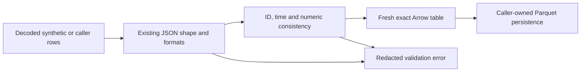

# Exact record-set normalization boundary

The opt-in `schemas.health_recordset_normalization.normalize_rows` API accepts
already-decoded JSON rows and returns a fresh Arrow table for one of the eight
v1 record sets. It is a Phase 3.1 prerequisite slice for M-05/M-06/M-18,
AC-05/AC-16. Existing structural descriptors and source packages are unchanged.

The boundary validates the existing JSON shape with format checking enabled,
preserves row order and IDs, rejects empty/duplicate IDs within the input set,
converts dates/timestamps and fixed-point decimal strings exactly, and rejects
reversed known valid-time endpoints. Timestamps exceeding six fractional digits
are rejected before conversion to Arrow microseconds. Numeric conversion uses
integer coefficient arithmetic independent of the caller's Decimal context.

A missing amount requires a nonblank null reason. A present amount requires no
null reason and a declared precision/scale pair (1–38 digits, nonnegative scale
no greater than precision). Exact values must fit that declaration, including
values carried with trailing zeroes. Null amounts may retain a valid declaration
or leave both precision and scale unknown. Source tokens remain untouched.

These APIs do not read files, perform I/O, acquire source data, generate IDs,
interpret units, approve classification mappings, resolve formula caches,
verify source hashes or prove cross-record lineage closure. Callers retain
source-file bounds and package validation. Unknown
units, dates and supplied rights labels remain unchanged; accepting a row is
not a redistribution decision. No adapter or publication path is rewired.

## Bounded JSON admission and Arrow readback

`normalize_json` accepts a UTF-8 JSON array in bytes, with an 8-MiB default
admission budget and 100,000-row default conversion budget. Caller overrides
are explicit; booleans and invalid limits are rejected. Duplicate members at
every object depth, nonfinite constants, BOMs, binary source bytes, malformed
UTF-8/JSON and excessive nesting fail with the same redacted error. No workbook,
PDF or SQLite source is decoded heuristically. The byte budget applies before
JSON parsing; the row budget applies before Arrow construction.

`normalize_rows` also enforces its row budget. It rejects RFC 3339's unknown
`-00:00` offset instead of treating it as known UTC, and rejects dates whose UTC
conversion exceeds Python's supported year range. Unicode values that cannot
be represented by Arrow UTF-8 fail without exposing source text.

`validate_table` revalidates an already-decoded Arrow/Parquet table against exact
schema metadata and nullability, row/byte budgets, row constants and the same
numeric/time/ID constraints. Its default decoded-table budget is 8 MiB.
Nullable values and exact Decimal/date representations are converted in memory
and checked through `normalize_rows`; the caller's table is unchanged. Required
nulls and wrong version constants can exist in an Arrow table despite its
declared schema, so successful Parquet decoding alone is insufficient.
Parquet file parsing, parser limits and source-byte fixity remain caller-owned.

## Coordination and remaining scope

Main's pre-existing edits to `tests/schemas/test_health_recordsets.py`,
`tests/schemas/test_health_recordset_json.py` and its untracked
`tests/fixtures/health-recordset-fixtures-v1.json` were inspected read-only.
They remain owned by the other actor. This slice uses a separate synthetic
fixture factory and tests conversion/consistency, without copying those edits.
The stored main fixtures require conversion of JSON decimals/dates/timestamps
before an Arrow round trip; their declared source precision and value tokens
also require review before they can serve as semantic golden records.

The original broad positive Phase 3.1 fixture task remains unchecked for complete
source-specific identity and semantic fixture qualification. The negative
fixture task is now covered by the [bounded matrix](./negative-fixture-matrix.md),
which combines these new transport negatives with existing source-profile
contracts. Neither task implies every source has a qualified projection,
authoritative classification, complete lineage joins or a finished Silver phase.
The global registry stays untouched as requested; its parent owner should
retain the health track as in progress and may add the local checkpoint SHA.
