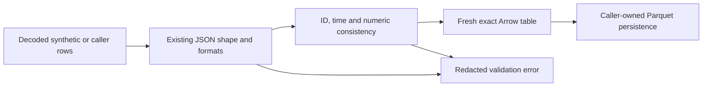

# Exact record-set normalization boundary

The opt-in `schemas.health_recordset_normalization.normalize_rows` API accepts
already-decoded JSON rows and returns a fresh Arrow table for one of the eight
v1 record sets. It is a Phase 3.1 prerequisite slice for M-05/M-06/M-18,
AC-05/AC-16. Existing structural descriptors and source packages are unchanged.

The boundary validates the existing JSON shape with format checking enabled,
preserves row order and IDs, rejects empty/duplicate IDs within the input set,
converts dates/timestamps and fixed-point decimal strings exactly, and rejects
reversed known valid-time endpoints. Timestamps exceeding six fractional digits
are rejected before conversion to Arrow microseconds. Numeric conversion uses
integer coefficient arithmetic independent of the caller's Decimal context.

A missing amount requires a nonblank null reason. A present amount requires no
null reason and a declared precision/scale pair (1–38 digits, nonnegative scale
no greater than precision). Exact values must fit that declaration, including
values carried with trailing zeroes. Null amounts may retain a valid declaration
or leave both precision and scale unknown. Source tokens remain untouched.

This API does not decode files, perform I/O, acquire source data, generate IDs,
interpret units, approve classification mappings, resolve formula caches,
verify source hashes or prove cross-record lineage closure. Callers retain
resource bounds, duplicate JSON-member checks and package validation. Unknown
units, dates and supplied rights labels remain unchanged; accepting a row is
not a redistribution decision. No adapter or publication path is rewired.

## Coordination and remaining scope

Main's pre-existing edits to `tests/schemas/test_health_recordsets.py`,
`tests/schemas/test_health_recordset_json.py` and its untracked
`tests/fixtures/health-recordset-fixtures-v1.json` were inspected read-only.
They remain owned by the other actor. This slice uses a separate synthetic
fixture factory and tests conversion/consistency, without copying those edits.
The stored main fixtures require conversion of JSON decimals/dates/timestamps
before an Arrow round trip; their declared source precision and value tokens
also require review before they can serve as semantic golden records.

The two original broad Phase 3.1 fixture tasks remain unchecked. This slice
does not complete adapter-negative fixtures, stable identity derivation,
classification evidence, lineage joins or the whole Silver foundation phase.
The global registry stays untouched as requested; its parent owner should
retain the health track as in progress and may add the local checkpoint SHA.
