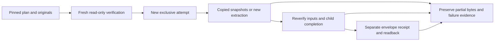

# Exclusive local resume execution — implementation contract

Scope: the four existing Budget-2025, BEFU-2025, HYEFU-2024 and fiscal-2024
raw-workbook profiles. Development initially used the explicitly unmerged
read-only planner checkpoint `ce9c8b8b538530afabd2f6c9710d52a6092ab56f`; planner
PR #320 is now delivered and integrated at its merge
`2c7a59913a77badcaece3a87366ee50a4a97c49d`. This is not a generic retry engine.

The default is read-only. A caller supplies the previously reviewed plan file
and its SHA-256 together with the donor, old PLAN, original CAS and stage pins.
The freshly recomputed plan must agree exactly; no silent replan or fallback is
allowed. An explicit false dry-run flag permits only a new exclusive attempt
under an existing reviewed local parent. Old attempts, donor metadata and CAS
originals remain untouched. Reused stage files are verified bounded immutable
byte snapshots, never hardlinked. Re-extraction uses the existing public source
adapters and preserves their source-specific recordsets.



## Native checkpoint

`COVERAGE_CORE=ctrace PYTHON_JIT=0 PYTEST_XDIST_AUTO_NUM_WORKERS=4
./scripts/validate.sh` passed with exit 0 at `aaba5ae`: 4,015 tests, eight existing
SQLite resource warnings, 138.83s main test stage, 97.34% overall coverage; 75
Conductor tracks, 42 schemas/32 representative documents, 9/9 parity, all native
mutation gates, dependency/licence/secret checks and the 111-component SBOM.
Log SHA-256 `4d7ffbed26165324803dca3542d20dfeb90f856032a3d78b327e306b9a0dabc1`;
exit receipt `9a271f2a916b0b6ee6cecb2426f0b3206ef074578be55d9bc94f6f3fe3ab86aa`.
All reviewed source hashes are unchanged. Three generated timestamp-only fields
in two unrelated legislation migration receipts were restored, not committed.
Retained-original pilot and hosted delivery are separate pending evidence.

## Budget stack integration

Ordinary merge `53e6a35` incorporates reviewed Budget projection PR #322 head
`2bba6daa9bcc72b1d529d48850ea0535bedae04a`. All 114 incoming evidence lines
remain an exact byte prefix before the three executor events. All three
production and two executor/completion test hashes are unchanged. The initial
post-integration command named nonexistent `test_budget_canonical.py` and exited
4 with no tests; the corrected discovered `test_budget_projection.py` selection
passed all 134 combined tests in 64.29s, and Conductor validated 75 tracks.
Budget hosted delivery remains a separate dependency gate.

Controlled-boundary ownership checks detect replacement of reviewed directories;
this is not an atomic whole-filesystem transaction or hostile-race sandbox. A
child raw-run MANIFEST proves only the independently verifiable legacy run. It
does not prove envelope success. If later envelope write/readback fails, the
child and best-effort failure evidence are retained. Failure evidence must never
mask an original exception or interrupt; marker presence alone is insufficient.

The envelope verifier checks current child transport, bounded schemas/counts and
legacy amount lineage. It does not reassert continued availability of the old
attempt, semantic truth of sources, rights clearance, canonical promotion, Gold
execution or publication. There is no CLI, MCP or scheduler in this slice.

Required assurance includes all 16 reuse/re-extract combinations, deterministic
two-attempt output bytes and equality to a fresh same-runtime rebuild, original
immutability, pins/drift, strict flags, collisions/symlinks, ownership changes,
every controlled write/finalizer boundary, interrupted/failing evidence writes,
resource exact-boundary tests, property tests and independent review. Critical
coverage, cold mutation and the native harness remain required before delivery.
Cross-runtime SQLite header differences are not claimed byte-identical.

`describe_rebuild_completion` is a read-only legacy transport helper for reviewed
local roots; it is not independently resource-bounded or a semantic validator.
The executor first invokes public `verify_resume_stages` to impose exact profiles,
transformation/context/count/schema checks and bounded Parquet metadata and rows.
It caps original snapshots before legacy verification and checks exact child-root
contents. The envelope verifier repeats these checks independently. Its saved
plan has a closed shape; reuse row counts and pins agree with the current child.
Historical reasons are bounded recorded decisions, not freshly re-proved old
attempt state. Final readback rechecks the receipt, saved-plan pin and envelope
shape after the child read.

## Initial evidence

- CPython 3.14.6, isolated locked environment; no source acquisition/publication.
- Public completion-descriptor tests: four failures because the API was absent.
- Executor tests: missing-module collection failure before implementation.
- First focused implementation: 12 tests passed, then 39 tests passed in 15.83s,
  including 16 mixed-action combinations and deterministic raw-run byte equality.
- Independent review reproduced a malformed-transformation child-marker bug;
  strict stage schema/count/Thrift validation now precedes legacy completion.
  Six malformed saved-plan shapes reproduced verifier gaps and are now rejected.
  The initial extra numeric test exposed a misplaced test assertion (corrected);
  strict boolean/int aliases and float tokens have dedicated pre-write tests.
- An incorrectly configured diagnostic coverage invocation (zero threshold and
  a module-name typo) was stopped after one test with exit 130. It supplies no
  assurance. Corrected critical coverage required 100%; 209 tests passed but
  coverage was 99.34% (four lines and one partial branch), an explicit failed gate
  addressed by additional malformed-JSON and unsealed-plan mismatch tests.
- PR #318 forecast dispatcher was merged after seven exact-head successful checks
  at head `a55d78588c02b82a4d823e71b794556e94c6ca2e`, ordinary merge
  `d46d3983a1a40581bbd11f446c2b75a35e4f0d15`, 2026-08-31T17:02:19Z.
  This delivery receipt does not complete broader operational coverage.
- Final pre-mutation focused critical gate: 248 tests passed in 53.20s; all three
  changed production modules reached 100% line and branch coverage (608 statements,
  154 branches). Ruff and BasedPyright passed. Independent source/helper review
  found no remaining actionable issue within the reviewed local-filesystem scope.
  Executor source SHA-256:
  `be5a02fbef522eba28dd76d65c35febfea8e73fe6b983a74c4b6e2b3419b8f8c`.
  Two additional red tests showed late saved-plan/failure-marker drift could escape
  readback; final pin and shape checks fixed both before this gate.
- Cold mutation, native validation and retained-original pilot are still pending;
  none is inferred from focused coverage or independent review.
- Functional checkpoint `977b068`; ordinary integration `01adffe` incorporates
  merged planner PR #320 (`2c7a59913a77badcaece3a87366ee50a4a97c49d`). All three
  reviewed production hashes are unchanged. The 113-line incoming evidence
  ledger is preserved as an exact byte prefix before the executor append.
- Post-integration: 97 executor/completion tests passed in 47.07s; Conductor
  validated 75 tracks. No reviewed source or test bytes changed during integration.
- Cold mutation at `71587e2`: 306/306 killed; zero survivors, timeouts, errors,
  pardons or cache hits. The same 248 tests passed in 385.12s. One worker, unchanged
  timeout, cold cache and no coverage filtering were used for all three changed
  modules. Report SHA-256:
  `d2bd4af8183e416e94fb93cb60237a29e9e5aa2ba650dbd25884c3be031afc0d`;
  log `f6e8a49e98f8fdb28df84db1d63d2659a28e9412ce6e91df560dde5957b7567b`.
  Production hashes remain unchanged; native and retained-original validation
  remain pending at this checkpoint.

```sh
uv run pytest tests/domains/health_appropriations/test_resume_execution.py tests/domains/health_appropriations/test_rebuild_completion.py tests/domains/health_appropriations/test_rebuild_resume.py tests/domains/health_appropriations/test_rebuild.py -q --gremlins --gremlin-targets=src/archive_govt_nz/domains/health_appropriations/resume_execution.py,src/archive_govt_nz/domains/health_appropriations/rebuild_resume.py,src/archive_govt_nz/domains/health_appropriations/rebuild.py --gremlin-report=json --gremlin-parallel --gremlin-workers=1 --gremlin-clear-cache --gremlin-no-coverage-filter --strict-pardons --gremlin-max-pardons-pct=0 --max-pardons=0 --no-cov
```
