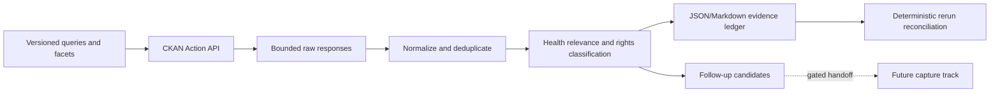

# Design

All network access is read-only metadata discovery. Raw responses are retained
only within the configured response limit and are linked by SHA-256. A stable
dataset identifier is the deduplication key; query provenance remains separate
so overlapping searches are auditable.
