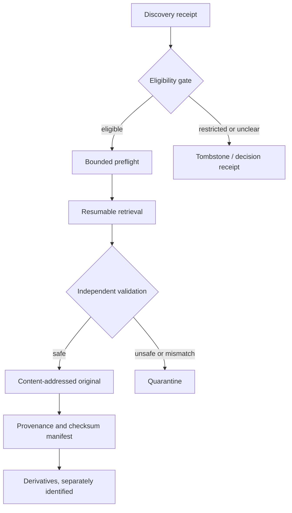

# Design

```mermaid
flowchart TD
  D[Discovery receipt] --> C{Eligibility gate}
  C -->|eligible| P[Bounded preflight]
  C -->|restricted or unclear| T[Tombstone / decision receipt]
  P --> R[Resumable retrieval]
  R --> V{Independent validation}
  V -->|safe| O[Content-addressed original]
  V -->|unsafe or mismatch| Q[Quarantine]
  O --> M[Provenance and checksum manifest]
  M --> X[Derivatives, separately identified]
```

Publication is outside this track and requires a later approval gate.
