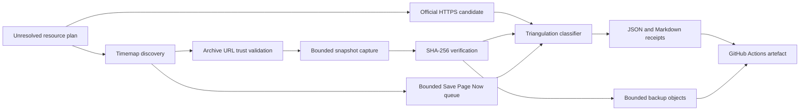
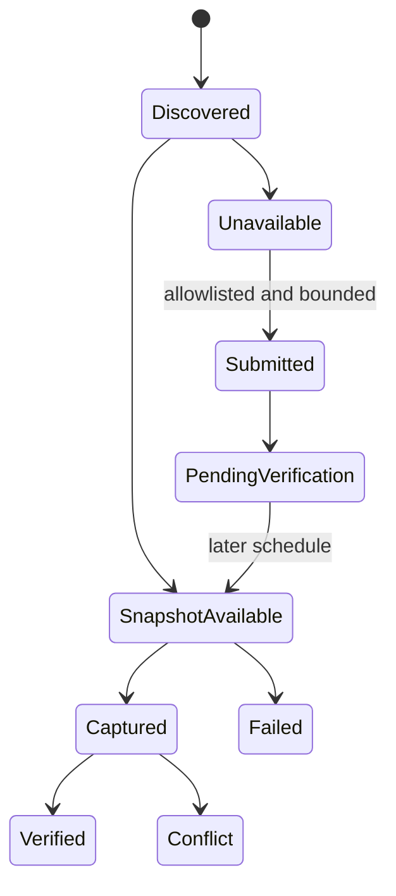

# Design

The discovery receipt is untrusted input to the capture stage. Capture accepts
only `https://web.archive.org/` URLs and applies byte/time limits before writing
an object. A local SHA-256 is authoritative for the captured bytes; Internet
Archive digests remain independently recorded evidence.

Save Page Now submission is a separate state from capture. Submission is
limited to allowlisted New Zealand government hosts, never follows a source
URL locally, and never upgrades archive completeness until a later timemap and
capture observation succeeds.

GitHub Actions artefacts provide bounded operational retention. Hugging Face
publication remains a separate future gate because it requires durable object
layout, remote hash reconciliation, and credentialed writes.
