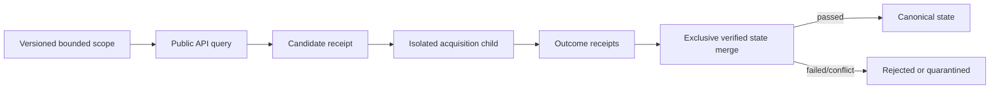

# Design

```mermaid
flowchart LR
  S[Versioned bounded scope] --> Q[Public API query]
  Q --> C[Candidate receipt]
  C --> A[Isolated acquisition child]
  A --> R[Outcome receipts]
  R --> M[Exclusive verified state merge]
  M -->|passed| K[Canonical state]
  M -->|failed/conflict| X[Rejected or quarantined]
```
