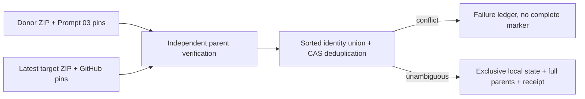

# Design

Same manifestation with changed bytes or metadata blocks without selecting a winner. Versions remain linked by work and expression. Conditional request caches reset for unconditional revalidation; parent originals remain retained. Canonical content is idempotent; execution lineage and completion inventory bind each run separately.
