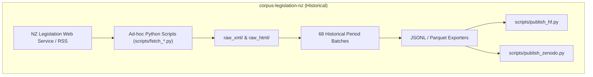
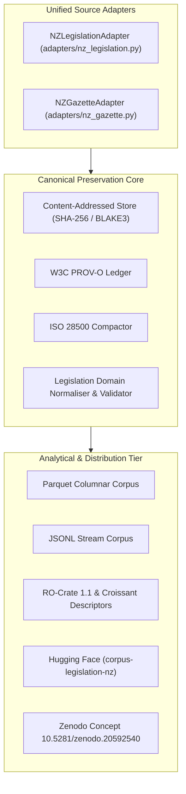
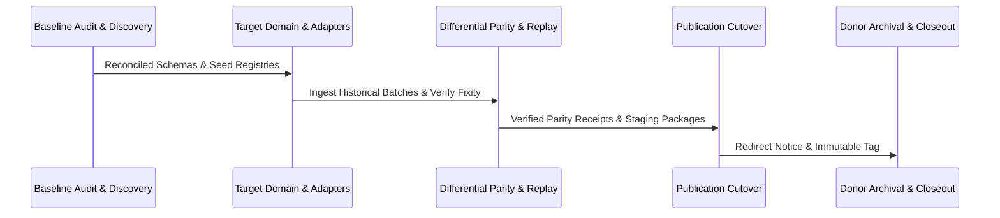
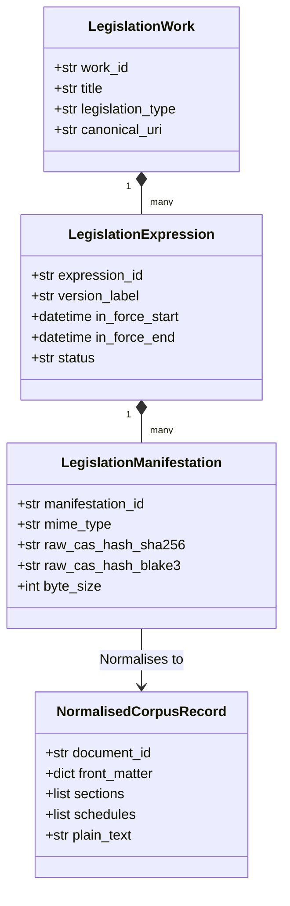
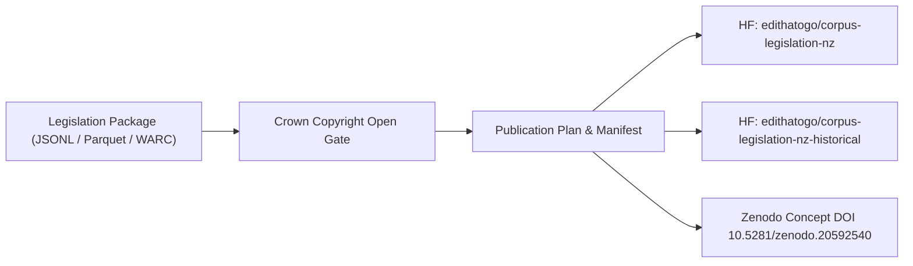
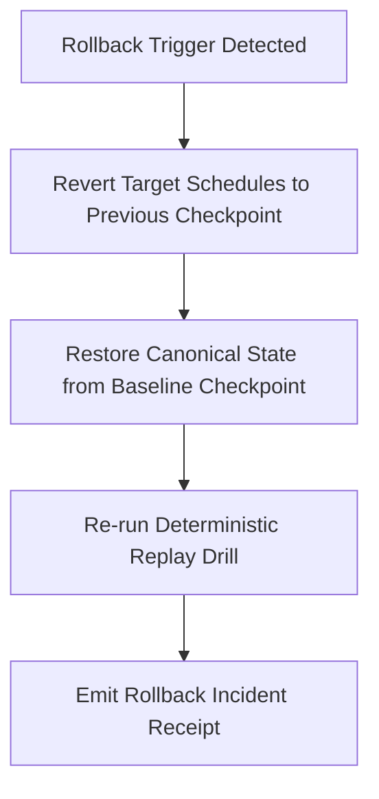

# Programme Specification: Legislation Corpus Consolidation

## 1. Current Donor Architecture (`corpus-legislation-nz`)

---

## 2. Target Architecture (`archive-govt-nz`)

---

## 3. Migration Stages

---

## 4. Legal Document Identity & Versioning Model

---

## 5. Publication Graph

---

## 6. Rollback Path

