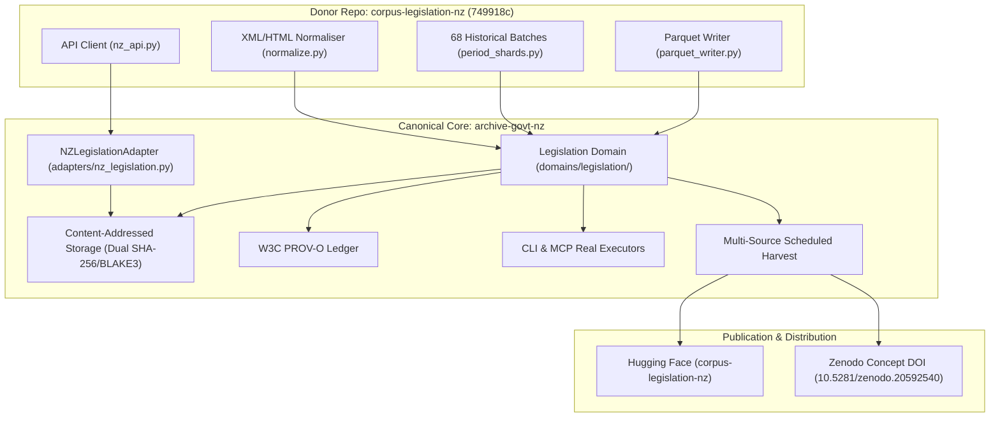

# Specification: Corrective Legislation Corpus Consolidation

## 1. Corrective Architecture



---

## 2. Legislation Domain Modular Architecture

```
src/archive_govt_nz/domains/legislation/
├── __init__.py          # Public exports
├── api.py               # Robust official API client with retry, backoff & ETags
├── discovery.py         # Work ID discovery, search filtering & scope bounds
├── identity.py          # FRBR Work, Expression, Manifestation & Versioning models
├── models.py            # Typed dataclasses for Acts, Bills, Regs, Provisions & Schedules
├── normalise.py         # Safe ElementTree XML/HTML parser (no regex stripping)
├── validate.py          # Schema validation & integrity assertion rules
├── manifest.py          # Source & transformation manifest compilation
├── coverage.py          # Evidence-backed completeness, gap analysis & audit reporting
├── changes.py           # Feed polling, ETag caching & change detection
├── checkpoints.py       # Resumable checkpointing & period-shard state persistence
├── bootstrap.py         # 68-batch merge, review & verification pipeline
├── corpus.py            # Columnar Snappy Parquet table compilation & JSONL streaming
└── publication.py       # Hugging Face & Zenodo package preparation & verification
```
