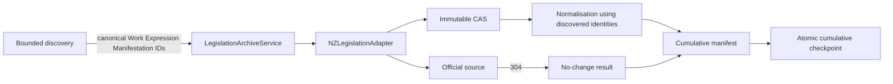

# Design

Discovery determines the bounded denominator and canonical FRBR targets. The
service does not synthesize missing discovery identities. All payload
acquisition passes through the existing adapter, which exposes source response
metadata and distinguishes a 304 from a new capture. The manifest is merged by
canonical manifestation identity and written before checkpoint promotion.
Separate stable roots authenticate the cumulative record manifest and the
sorted, unique discovered-work inventory used as the coverage denominator; the
checkpoint links both roots and the conditional request validators. A partial
batch remains resumable and is not marked completed. Corrupt prior state, an
empty or duplicate supplied identity, an identity collision, or an incomplete
canonical discovery graph fails closed before acquisition or state promotion.
