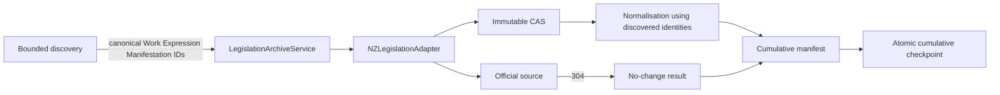

# Design

Discovery determines the bounded denominator and canonical FRBR targets. The
service does not synthesize missing discovery identities. All payload
acquisition passes through the existing adapter, which exposes source response
metadata and distinguishes a 304 from a new capture. The manifest is merged by
canonical manifestation identity and written before checkpoint promotion; the
checkpoint records the resulting cumulative manifest root and conditional
request validators. Corrupt prior state or an incomplete canonical discovery
graph fails closed.
