# Design

```mermaid
flowchart LR
 A[Pinned merged or sealed native state] --> B[Verify bytes, inner state and lineage]
 B --> C[Deterministic stored ZIP and exact inventory]
 C --> D[Verify expected outer digest]
 D --> E[Fresh quarantined local restore]
 D --> F[Minimal metadata projection]
 D --> G{Payload rights approved?}
 G -->|No| H[Metadata-only plan]
 G -->|Yes| I[Payload plan requiring external approval]
```

ZIP_STORED with sorted names and fixed headers avoids codec/version variance and compression bombs. Fresh private workspaces, bounded reads, exact pinning and no replacement are required. No network client exists in package commands. HF commit-addressed custody is selected prospectively, with no claim of provider-enforced immutability or completed remote preservation.
