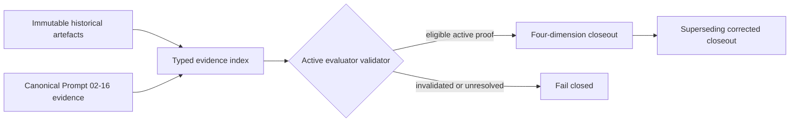

# Design

The index records classification, content hash, scope, claim dimensions, and supersession links. Historical bytes stay unchanged. Active evaluator inputs may cite only eligible evidence and cannot infer completion from issue, PR, workflow, or CI state alone.
