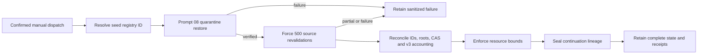

# Design

Only acquisition receives the optional source credential. The parent reference
and stable seed ID form the pre-network trust boundary. Exact-inventory and the
existing discovery writer share one repository concurrency key.
