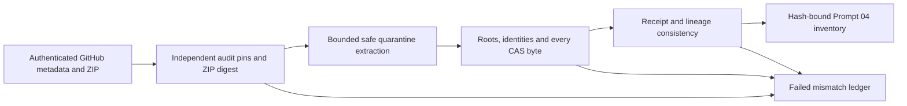

# Verification flow

No network in verifier; no canonical or publication writer. Trusted audit pins plus live metadata are inputs, not values derived from archive contents. Verified ZIP bytes are used directly by the ZIP reader, avoiding a second-open race.
