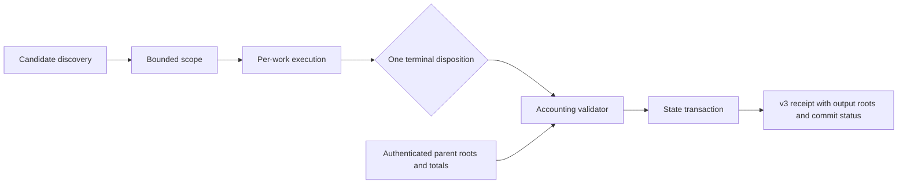

# Design

The service returns ordered per-work accounting rows rather than reconstructing categories in a caller. The seven terminal categories are mutually exclusive and exhaustive across `works_in_scope`. `works_attempted` excludes `already_processed_skipped`. Counts and roots describe observed parent and output state; the implementation validates arithmetic relationships that JSON Schema cannot express between sibling values.

`state_commit_status` is an explicit state machine: `committed`, `no_change`, `not_committed`, `partial_committed`, or `indeterminate`. A committed or partially committed receipt requires output manifest and checkpoint roots plus the exact state commit identity. CAS objects may be written before canonical state commit, so CAS before/after totals remain independent from record-state commit and must always be observed.

The reader treats v2 and v3 as a tagged union. A v2 receipt retains its original fields under a legacy evidence classification and is never assigned v3 dispositions, deltas or commit proof.
