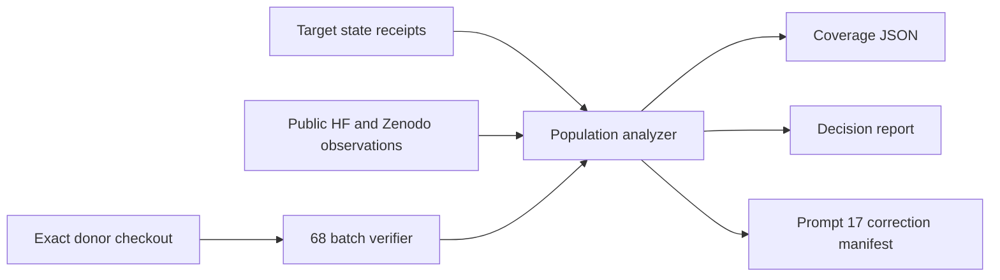

# Design

Counts carry population type, observation status and hash-bound evidence. Identity sets are unioned rather than arithmetically summed. Missing acquisition or publication evidence remains unknown and does not imply absence.
