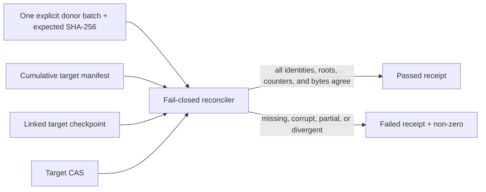

# Design

The donor batch is an explicit bounded identity set, not a completeness
denominator. Its canonical line-normalized SHA-256 binds the input. The target
manifest may contain cumulative state beyond the selected batch, but the
selected batch must be named completed and every selected work must be present
in discovered, processed, manifest, and CAS evidence. Manifest and inventory
roots are recomputed and linked to the checkpoint before any success state.

The reconciler is zero-network and read-only except for its explicit receipt.
It does not execute a capture or substitute fixtures for a real run. Actual
batch execution remains a later ordered gate; until then, the tool must return
failure for absent real inputs.
