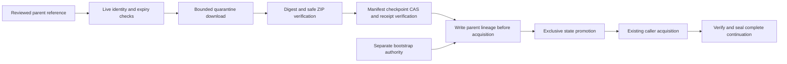

# Design

Any failure stops before promotion/acquisition and retains a sanitized failure receipt. Incoming receipt bytes remain content-addressed history. Remote storage and publication are outside this interface.
