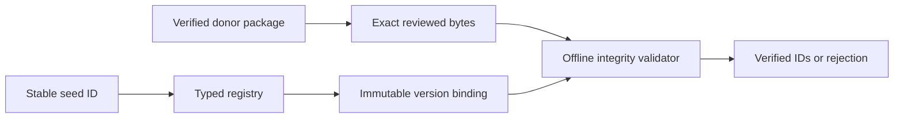

# Design

Registry entries carry immutable origin/content identities separately from dated observations. The initial version binding is anchored in the Prompt 03 inventory receipt. New versions use new stable IDs and paths; prior entries and bindings are retained. No network or workflow execution occurs during selection. Git review protects the registry and its version history; hashes do not replace that authority.
