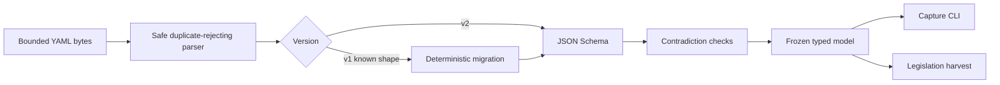

# Design

```mermaid
flowchart LR
  Y[Bounded YAML bytes] --> P[Safe duplicate-rejecting parser]
  P --> M{Version}
  M -->|v1 known shape| G[Deterministic migration]
  M -->|v2| S[JSON Schema]
  G --> S
  S --> C[Contradiction checks]
  C --> T[Frozen typed model]
  T --> CLI[Capture CLI]
  T --> H[Legislation harvest]
```

Schema `additionalProperties: false` closes nested trust boundaries. Capability and activation are separate fields. Publication/external actions remain inactive.
