# Specification: Medallion Architecture Consolidation with Integrated Vector & Knowledge Graph Products

- **Track ID:** `medallion_architecture_consolidation_20260823`
- **Domain Scope:** Core canonical archive domains (Legislation, Gazette, CKAN data.govt.nz, Health/MoH, Treasury, Feeds/Social)
- **Federated Alignment:** [`edithatogo/global-medicines-atlas`](https://github.com/edithatogo/global-medicines-atlas)
- **Status:** `new`

---

## 1. Overview & Architectural Vision

This track establishes the canonical, evidence-first **Medallion Data Architecture (Bronze → Silver → Gold)** for `archive-govt-nz`, strictly aligned with the design patterns, bitemporal data models, and federation contracts in `global-medicines-atlas`.

Rather than treating semantic vector search and graph relations as separate, uncoordinated infrastructure, this architecture subsumes graph and vector indexing directly into the **Gold Layer** as deterministic, embedded derived products built on top of canonical **Silver Parquet** tables.

```mermaid
flowchart TD
    subgraph Sources["Consolidated & Federated Source Ingestion"]
        PHYS["Physical Merges: sm-govt-nz, corpus-legislation-nz"]
        CAP["Capability Assimilation: corpus-nz-hansard, hathi-nz, fyi-archive, RIOPA, medilegal"]
        PUB_SRC["CKAN, MoH, Treasury, Official Feeds"]
    end

    subgraph Bronze["🥉 Bronze Layer — Raw Acquisition & Immutability"]
        CAS["Content-Addressed Storage (SHA-256 / BLAKE3)"]
        WARC["WARC & WACZ Bitstreams"]
        RAW_SNAP["Raw XML/HTML/JSON Source Snapshots"]
        B_PROV["Raw Ingestion & Retrieval Manifests"]
    end

    subgraph Silver["🥈 Silver Layer — Canonical Cleaned Evidence Core"]
        NORM["Domain Normalizers & Statutory/Notice Parsers"]
        CANON_PQ["Canonical Parquet Tables (Polars / PyArrow)"]
        BITEMP["Bitemporal Timeline (source_observed_at vs in_force_date)"]
        CANON_SCH["Versioned JSON/Arrow Schemas (v1 / v2 Conformance)"]
        INTERLINK["Cross-Domain Entity & Identifier Interlinks"]
        S_PROV["Lineage & Transformation Manifests"]
    end

    subgraph Gold["🥇 Gold Layer — Analytical Derivatives & Consumption"]
        DUCK["DuckDB Analytical Views & Cross-Domain Joins"]
        LANCE["Embedded LanceDB Hybrid Vector Search Index"]
        PUB_PKG["RO-Crate 1.1 / Croissant / Release Packages"]
        CLI_MCP["Unified CLI (archive-govt-nz query) & FastMCP Server"]
        DIST["Common Publication Adapters (HF, Zenodo, OSF, GitHub Releases)"]
    end

    Sources --> Bronze
    Bronze --> Silver
    Silver --> Gold
```



---

## 2. Consolidation & Federation Boundary Map

The repository topology strictly enforces the converged consolidation boundary:

```text
archive-govt-nz
├── sm-govt-nz                 ← physical merge (completed)
├── corpus-legislation-nz      ← physical merge (completed)
├── shared archive/preservation capabilities from:
│   ├── corpus-nz-hansard      ← selective capability assimilation (later)
│   ├── hathi-nz               ← selective capability assimilation (later)
│   ├── fyi-archive            ← shared publication substrate (federated)
│   ├── open_social_data/RIOPA ← shared archival infrastructure (federated)
│   └── corpus-cases-medilegal ← shared preservation core (separately versioned)
└── common publication adapters
    ├── Hugging Face
    ├── Zenodo
    ├── OSF
    └── GitHub Releases
```

### Boundary Invariants
1. **Physical Merges:** Limited to `sm-govt-nz` and `corpus-legislation-nz`.
2. **Capability Assimilation (Federated):** Shared preservation and publication machinery assimilated from `corpus-nz-hansard`, `hathi-nz`, `fyi-archive`, `open_social_data`, and `corpus-cases-medilegal-nz`, while keeping their domain analytics and citable products distinct.
3. **Explicitly NOT Merged (Whole Independent Products):** `legislation`, `dnz`, `healthpoint-rs`, `fyi-cli`, `foi-o`, `searchright`, `sourceright`, and `reimbursement-atlas`.

---

## 3. Functional Requirements by Layer

### 3.1 🥉 Bronze Layer (Raw Ingestion)
- **MUST-1 (Immutability & Integrity):** Strict immutability in CAS (`sha256/` and `blake3/`) and WARC/WACZ containers for raw XML, HTML, JSON, and PDF payloads.
- **MUST-2 (Ingestion Manifests):** Generate standard Bronze ingestion manifests recording source URLs, timestamps, headers, payload digests, and rate limits.

### 3.2 🥈 Silver Layer (Canonical Evidence Core)
- **MUST-3 (Vectorized Parquet Pipelines):** Vectorize and normalize raw records into typed, schema-validated Apache Parquet and JSONL files (`data/silver/{domain}/corpus.parquet`) using **Polars** and **PyArrow**.
- **MUST-4 (Bitemporal Tracking):** Record transaction time (`source_observed_at`) alongside valid time (`effective_date`, `in_force_date`, `revoked_date`) to support point-in-time reconstruction.
- **MUST-5 (Cross-Domain Entity Joins):** Maintain deterministic relational linkage tables (Statutes ↔ Gazette Notices ↔ Health Payloads ↔ CKAN packages) with confidence scoring and provenance pointers.

### 3.3 🥇 Gold Layer (Analytical Derivatives, Search & Knowledge Graph)
- **MUST-6 (DuckDB Analytical Engine):** Provide embedded **DuckDB** database views and SQL aggregation models over Silver Parquet for fast relational queries.
- **MUST-7 (Embedded LanceDB Hybrid Search):** Build a local LanceDB vector + BM25 hybrid search index derived directly from Silver Parquet, providing zero-network local semantic lookup without external SaaS lock-in.
- **MUST-8 (Semantic Knowledge Graph Export):** Export semantic linked data adhering to W3C **DCAT-AP 3.0**, **schema.org / Croissant**, and **RO-Crate 1.1** metadata models aligned with `global-medicines-atlas`.
- **MUST-9 (CLI & MCP Query Interface):** Expose Gold DuckDB, LanceDB, and Knowledge Graph operations through `archive-govt-nz query` (`--sql`, `--semantic`, `--graph`) and FastMCP server tools.

---

## 4. Non-Functional Requirements & Invariants

- **Zero-Network Reproducibility:** Gold layer can be fully wiped and reconstructed from Silver; Silver can be fully reconstructed from Bronze.
- **Strict Quality Gates:** All new modules must satisfy Python 3.14 typing (`basedpyright`), 100% patch coverage, >=95% total branch coverage, mutation tests, and zero-slop checks.
- **Supply-Chain Integrity:** CycloneDX SBOM, `pip-audit`, `pip-licenses`, and `detect-secrets` pass cleanly on every build.
