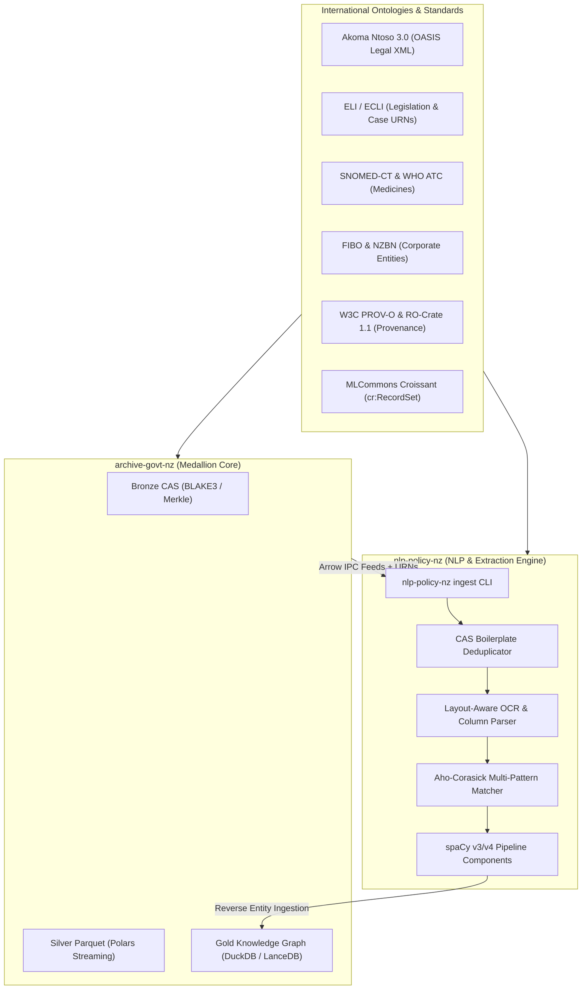

# Specification: Medallion NLP Bi-Directional Bridge, Bleeding-Edge OCR & Ontological Synthesis

## 1. Overview
Establishes a hardened, high-performance bi-directional integration bridge between the upstream preservation data engine (`archive-govt-nz`) and the downstream NLP policy extraction engine (`nlp-policy-nz`).

The architecture maximizes data utility and computational efficiency through:
1. **International Legal & Domain Ontologies:** Akoma Ntoso 3.0 (OASIS legislative standard), European Legislation Identifier (ELI), SNOMED-CT / ATC (medicines and health), FIBO/NZBN (corporate entities), and W3C PROV-O (cryptographic provenance).
2. **Bleeding-Edge & Rust-Native Acceleration:** High-throughput streaming with Polars 1.x, LanceDB (SIMD AVX-512 vector search), Aho-Corasick multi-pattern matching, and SIMD BLAKE3 fixity hashing.
3. **Layout-Aware Parsing & OCR Modernization:** Multi-column segmentation, de-skewing, and table structure preservation for degraded historical scans (Hansard 1854–1985, historical Gazette notices, and HathiTrust NZ volumes).
4. **Bi-Directional Knowledge Graph Feedback:** Structured NLP annotations (statutory citations, company registration numbers, disciplinary findings, speech turns) feed back into DuckDB and LanceDB Gold layer views (`v_gold_extracted_entities`, `v_gold_statutory_graph`).
5. **Zero-Copy Arrow IPC & Content-Addressable Deduplication:** Stream records over Arrow IPC without disk serialization overhead, skipping repeated boilerplate notices via CAS hash caches.
6. **Non-Functional Hardening & Hygiene:** Sub-50ms CLI startup via lazy imports, deterministic context-manager I/O cleanup, defensive memory caps (< 64MB buffers), and harmonized `uv.lock` environments.
7. **Dynamic FastMCP Server:** Automatically generates FastMCP tools from the unified 7-domain Medallion schema registry.

---

## 2. Ontological & Semantic Architecture

---

## 3. Functional Requirements

### 3.1 Ontological Alignment & Schemas
- **Akoma Ntoso 3.0 & ELI Schema Mappings:** Map legislative provisions, Hansard speech turns, and Gazette notices into standard Akoma Ntoso structure (`<debateSection>`, `<speech>`, `<akomaNtoso>`, `<act>`).
- **Health & Corporate Entity Ontologies:** Add typed fields for WHO ATC codes, active ingredients, and NZBN identifiers in [`src/archive_govt_nz/schemas/medallion.py`](file:///Volumes/PortableSSD/GitHub/archive-govt-nz/src/archive_govt_nz/schemas/medallion.py).
- **W3C PROV-O & Croissant ML Descriptors:** Embed exact character offset ranges and CAS hashes (`content_sha256`, `cidv1`) in all extraction outputs.

### 3.2 Layout-Aware OCR & Historical Text Extraction (`nlp-policy-nz`)
- Implement layout-aware bounding box and multi-column reading order reconstruction for dual-column historical Hansard and Gazette notices.
- Add de-hyphenation, ligature normalization, and character error correction tuned for 19th/20th-century New Zealand public typography.

### 3.3 Bleeding-Edge & Rust-Native Acceleration
- **Aho-Corasick Statutory Matching:** Integrate multi-pattern matching algorithm to cross-reference thousands of NZ Act titles and sections across text batches in sub-millisecond time.
- **Polars 1.x Streaming:** Replace in-memory PyArrow table mutations in `SilverPipeline` with Polars `LazyFrame.sink_parquet()` with bounded chunk sizes (< 64 MB RAM buffers).
- **Content-Addressable Boilerplate Deduplication:** Skip re-tokenization of repeated statutory disclaimers and administrative headers by caching extraction spans by SHA-256 / BLAKE3 chunk hashes.
- **Stateful Offset Checkpointing:** Enable interrupt-resilient resume for large historical corpora transforms via `.checkpoint` state markers.

### 3.4 Ingestion CLI Bridge & Packaged spaCy Components (`nlp-policy-nz`)
- Top-level CLI command `nlp-policy-nz ingest --feed <parquet_path> --extractor <name> --output <path>`.
- Packaged spaCy components:
  - `@Language.component("nz_gazette_extractor")`
  - `@Language.component("nz_hansard_extractor")`
  - `@Language.component("nz_medilegal_extractor")`

### 3.5 Reverse Gold Knowledge Graph Ingestion (`archive-govt-nz`)
- Implement `GoldKnowledgeGraphIngestor` to mount extracted entities and citations into DuckDB views:
  - `v_gold_extracted_entities`: Unified view of organizations, NZBNs, ministers, public bodies, and healthcare practitioners.
  - `v_gold_statutory_graph`: Directed graph of statutory authorities, citations, and legislative amendments.
- Embed extracted knowledge into LanceDB for hybrid semantic + full-text BM25 search.

### 3.6 Dynamic FastMCP Server Generation (`archive-govt-nz`)
- Derive FastMCP search and query tools dynamically from `DOMAIN_REGISTRY`, automatically exposing tools for all 7 public datasets.

---

## 4. Non-Functional Requirements & Hardening
- **Strict Static Typing:** 100% type-safe under `basedpyright` with 0 errors, 0 warnings, 0 notes.
- **Lazy Startup Latency:** Sub-50ms CLI invocations (`nlp-policy-nz --help`) via dynamic lazy module resolution across `storage`, `semantic`, and `pipeline`.
- **Deterministic Resource Cleanup:** Explicit context managers (`with`) on all DuckDB cursors, Arrow table streams, and Parquet writers to prevent file descriptor leaks.
- **Bounded Memory Ingestion:** Streaming ingestion throughput >= 50 MB/s per worker; maximum resident memory < 128 MB.
- **Supply-Chain Determinism:** Synchronized and verified `uv.lock` with zero missing dev tools and clean `pip-audit` security gates.
- **Quality Gates:** 100% pass across all 22 assurance stages (`./scripts/validate.sh`) in `archive-govt-nz` and unit test suites in `nlp-policy-nz`.

---

## 5. Acceptance Criteria
- [ ] Akoma Ntoso 3.0, ELI, NZBN, and WHO ATC schema attributes integrated in Medallion schemas.
- [ ] Layout-aware column segmentation and de-hyphenation tested on multi-column historical scans.
- [ ] Aho-Corasick statutory matcher resolves statutory references in sub-millisecond execution.
- [ ] CAS-based deduplication skips repeated boilerplate text blocks.
- [ ] `SilverPipeline` supports stateful chunk checkpointing and deterministic context-manager flushes.
- [ ] `nlp-policy-nz ingest` CLI command processes Parquet corpora and emits structured tables.
- [ ] spaCy components integrate cleanly into standard spaCy `nlp` pipelines.
- [ ] `GoldAnalyticsEngine` queries joined `v_gold_extracted_entities` and `v_gold_statutory_graph` in DuckDB.
- [ ] FastMCP server dynamically registers tools for all 7 domain datasets.
- [ ] `nlp-policy-nz` CLI starts up in < 50ms with clean lazy imports.
- [ ] All 22 assurance stages pass cleanly.
