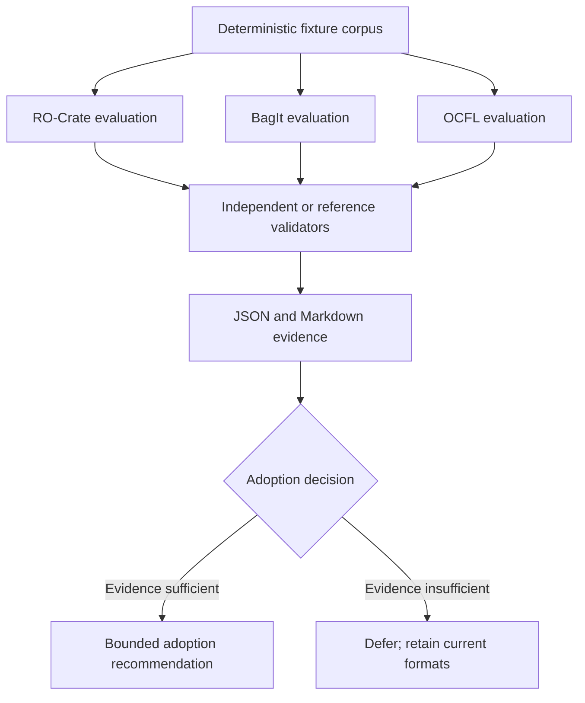

# Design

The fixture corpus contains raw metadata, one small source object, a tombstone,
checksums, provenance, and a redacted transaction receipt. Each evaluator must
be deterministic, preserve the original bytes, and emit an explicit unavailable
or partial result when a validator cannot run.
