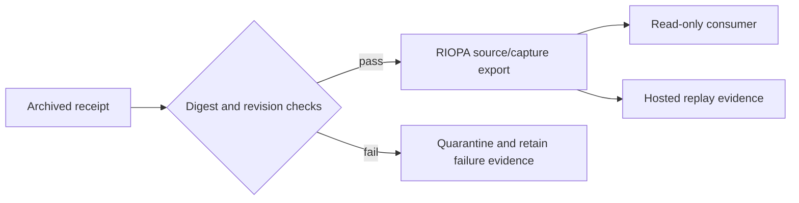

# Design: RIOPA interoperability integration

```mermaid
flowchart LR
  A[Archived receipt] --> B{Digest and revision checks}
  B -->|pass| C[RIOPA source/capture export]
  B -->|fail| Q[Quarantine and retain failure evidence]
  C --> D[Read-only consumer]
  C --> E[Hosted replay evidence]
```

The bridge is archive-only. Rights or legal-status uncertainty is carried as
data and blocks promotion; it is never resolved by the adapter.
