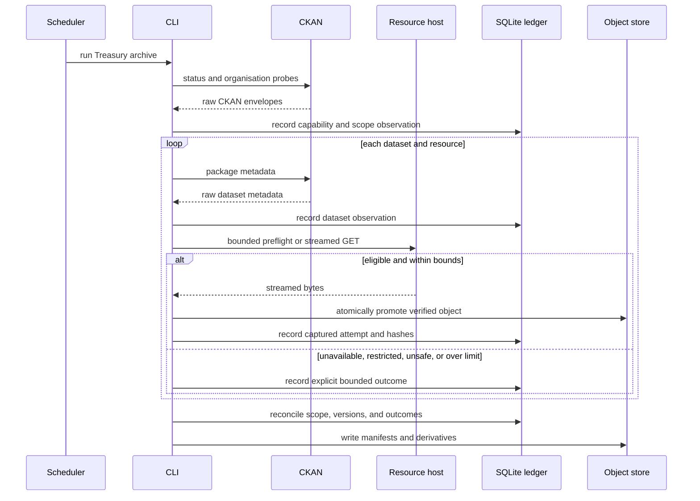
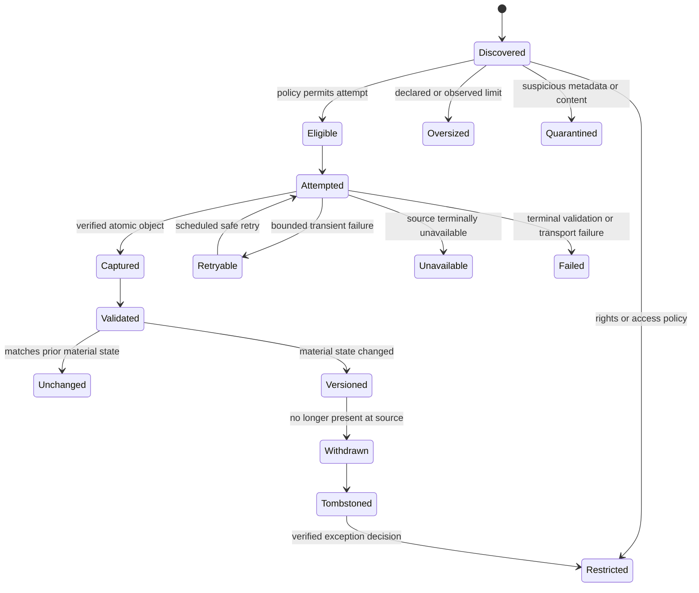
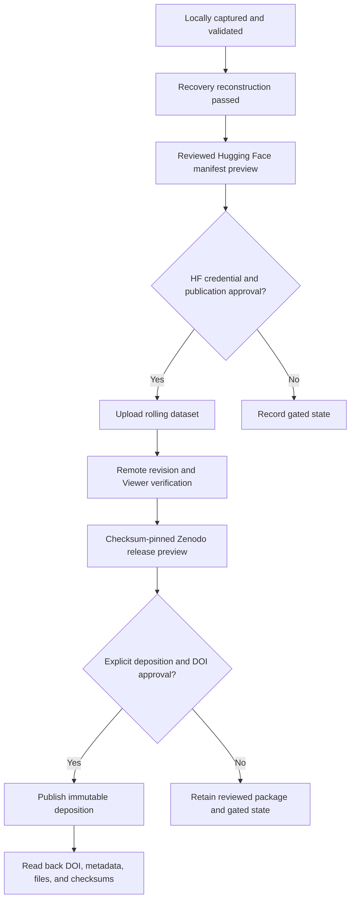

# Treasury Archive MVP Design

## Design goals

The MVP is a resumable pipeline with durable boundaries between untrusted
sources, immutable originals, operational state, reproducible derivatives, and
external publication. No hosted platform or rebuildable database is the sole
source of preservation truth.

Execution follows the project-level
[`continuous autonomous execution`](../../autonomy.md) state machine. Phase
checkpoints and this track's completion automatically advance to the next
approved work; only the publication, rights, security, destructive, credential,
or material-scope gates shown below can require a user decision.

## Component architecture

```mermaid
flowchart LR
    CKAN["data.govt.nz CKAN API"]
    Resource["Publisher resource hosts"]

    subgraph CLI["Python 3.14 archive package and CLI"]
        Probe["Capability probe"]
        Discover["Treasury discovery"]
        Policy["Fail-closed eligibility policy"]
        Fetch["Bounded streaming capture"]
        Version["Change and version engine"]
        Provenance["Manifest and provenance builder"]
        Derive["Parquet, JSONL, and WARC derivation"]
        Validate["Integrity, schema, and recovery validation"]
        Publish["Gated publication adapters"]
    end

    CAS["Content-addressed objects"]
    SQLite["SQLite operational ledger"]
    Evidence["Markdown and JSON evidence ledger"]
    GitHub["GitHub source, CI, issues, attestations"]
    HF["Rolling Hugging Face dataset"]
    Zenodo["Immutable Zenodo release"]

    CKAN --> Probe --> Discover
    Discover --> Policy
    Resource --> Policy
    Policy --> Fetch
    Fetch --> CAS
    Fetch --> SQLite
    CAS --> Version
    SQLite --> Version
    Version --> Provenance
    Provenance --> Derive
    Derive --> Validate
    CAS --> Validate
    Validate --> Evidence
    Evidence --> GitHub
    Validate --> Publish
    Publish --> HF
    HF -->|"verified revision and explicit DOI gate"| Zenodo
```

## Capture sequence

## Resource state machine

## Publication gates

## Storage authority

| Store | Purpose | Authority |
| --- | --- | --- |
| Content-addressed objects | Original bytes, raw metadata, durable receipts | Authoritative |
| Versioned manifests | Identity, relationships, provenance, state | Authoritative |
| SQLite | Transactions, retries, checkpoints, operational reconciliation | Rebuildable |
| Parquet and JSONL | Portable analysis and interchange | Derived |
| WARC | Material HTTP transaction context | Durable receipt |
| GitHub | Source, schemas, compact evidence, issues, CI | Delivery evidence |
| Hugging Face | Rolling permitted archive and derivatives | Verified remote copy |
| Zenodo | Citable immutable release | Verified release copy |

## Security boundaries

- Treat CKAN metadata, URLs, redirects, filenames, media types, archives, and
  resource bytes as untrusted.
- Stream through explicit byte, time, redirect, concurrency, storage, and
  decompression bounds.
- Never use a source filename as an object path.
- Keep temporary and quarantined objects outside publication roots.
- Pass credentials only through environment-scoped secret stores.
- Redact secrets, authentication headers, signed URLs, personal information,
  and unrelated local paths from logs and evidence.
- Require remote read-back before advancing an uploaded state to verified.

## Recovery invariant

A selected release manifest and its referenced content-addressed objects must be
sufficient to verify and reconstruct the bounded release without SQLite,
DuckDB, graph, vector, or hosted platform state.
